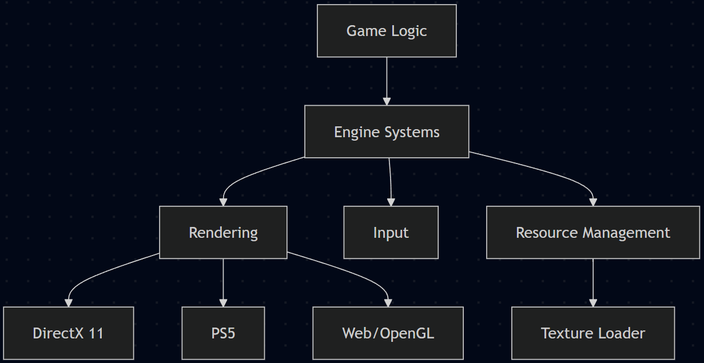

# Game Engine Architecture 
**Author:** Arnas

Game engines are complex systems put together to provide functionality for developing games for the most part. A key goal of engine design is abstracting core systems like rendering, input, and resource management away from game logic so that multiple projects can be built upon the same foundation [1](#Architecture). Game engines tend to vary in scope and flexibility since, at the simplest level, some games are created from scratch and are hard coded such as Pac-Man [2](#PacMan). This makes it harder to reuse later on in other projects, but more flexible engines were later developed to be resued more than one time. 

At higher levels engines begin to support a wider range of games in their particular genre. An example of this is the Quake III Arena engine [3](#QuakeSource), which enabled the development of multiple first-person shooters through modding [4](#QuakeModding). Modern engines such as Unity [5](#Unity) and Unreal [6](#Unreal) take this further beyond by allowing the creation of games through a broad range of genres and platforms. Going beyond that, creating an engine capable of supporting any type of game is in practice extremely difficult due to the varying technical requirements of different genres. For this project the scope of the engine is intentionally limited for the time frame. Rather than focusing on a specific genre or attempting to replicate commercial engines, the focus will be on 2D games/demos used to showcase core systems. Due to time constraints there will be design trade-offs, including a simplified rendering system, limiting advanced features such as dynamic management and prioritising implementation over perfection. 

    
     
    <em>Figure 1: Game engine architecture overview. (Figure is clickable).</em>

## References
<a id="Architecture">1</a> Gregory, J. (2018). *Game Engine Architecture* (3rd ed.). CRC Press.

<a id="PacMan">2</a>: CHARACTER│ The Official Site for PAC-MAN - Video Games & More. (n.d.). CHARACTER│ The Official Site for PAC-MAN - Video Games & More. [online] Available at: https://www.pacman.com/en/character/.

<a id="QuakeSource">3</a>: GitHub. (2022). id-Software/Quake-III-Arena. [online] Available at: https://github.com/id-Software/Quake-III-Arena.

<a id="QuakeModding">4</a>: ioquake3. (2025). ioquake3. [online] Available at: https://ioquake3.org/.

<a id="Unity">5</a>: unity (2020). Unity Technologies (2019). Unity. [online] Unity. Available at: https://unity.com/.

<a id="Unreal">6</a>: Epic Games (2019). What is Unreal Engine 4. [online] Unrealengine.com. Available at: https://www.unrealengine.com/.

[<- Back to Overview](../GraphicsOverview.md)