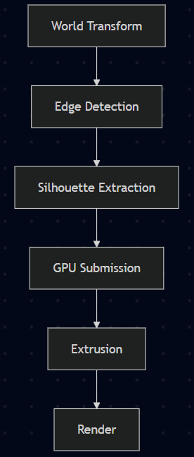
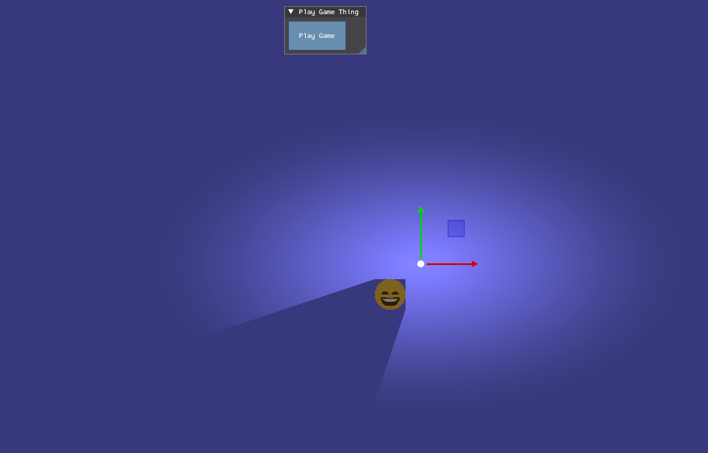
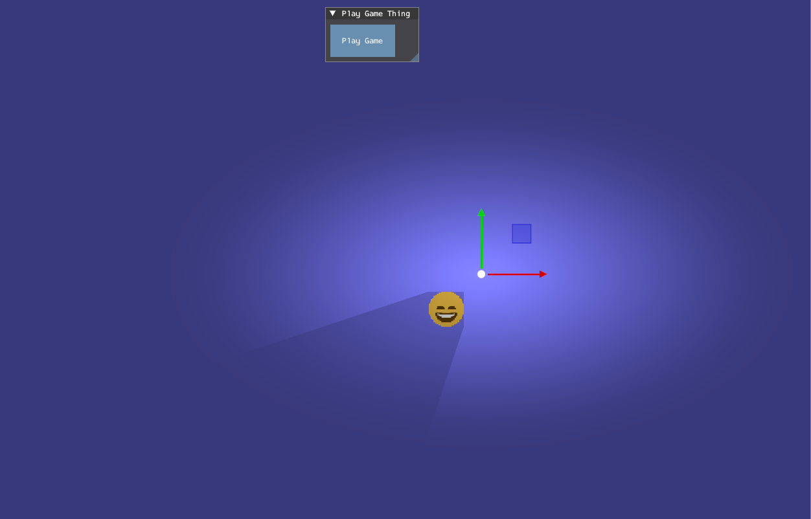
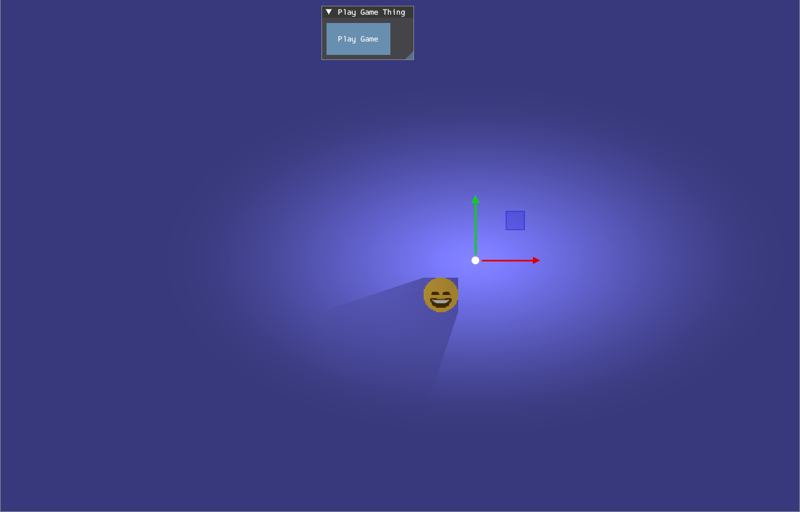
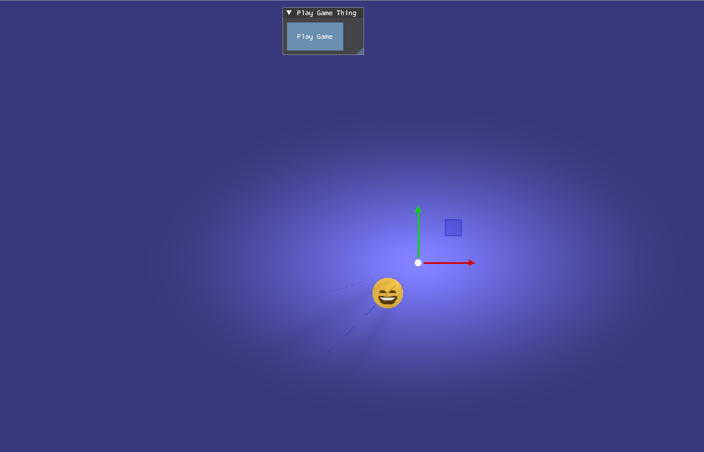

# Lighting and Shadows 
**Author:** Arnas
## Lighting
### Introduction
This section will look at justifying why the lighting system was made the way it was. Initially the lighting system was implemented as a simple point light model and was created primarily for the shadow generation. This approach used a linear falloff approximation that is similar to what is in Real-Time Rendering <sup>[1](#RealTimeRendering)</sup>, where light intensity decreases with distance from the source. Additionally, lighting calculations were done per object in the shader, which made it fast and suitable for the initial purposes.

However, this showed several limitations, like the light only affecting the objects directly and not being visible to the scene. This meant light would not be seen unless the objects interacted directly. It also didn't have other light types like spot light and directional light. 

### Multi Pass Rendering
To resolve these issues, the lighting system was reworked to use multi-pass rendering. This changed the lighting system from per-object calculations to a full-screen lighting pass that affects the entire rendered scene. Separating the scene into geometry rendering and light pass aligns with common real-time rendering techniques, where lighting is applied through screen space after the scene is rendered. Engines like Godot also apply a full-screen pass rather than applying lights in the scene pass <sup>[2](#GodotRenderingPasses)</sup>.

A full-screen triangle was used instead of a quad for the pass. This reduces unnecessary vertex processing and eliminates interpolation along triangle edges, making it more efficient than rendering two triangles <sup>[3](#FullscreenOptimisation)</sup> <sup>[4](#GDCTriangle)</sup>. Finally, a full-screen final pass combines all light contributions and outputs the result to the back buffer. Directional light is also applied in this stage as global light, ensuring there is a uniform light across the scene.

### Light Types
To create a more complete lighting system, three primary light types were implemented. With point, spot and directional being widely reconised as common ones <sup>[1](#RealTimeRendering)</sup> <sup>[5](#UnityLightTypes)</sup>:
- Point light emits light that goes off in all directions from a single positon (light position). The exisiting implementation was the same as it was efficent and suitable for our 2D engine.
- Spot lights emit light within a cone-shaped region defined by positon, direction and cone angle <sup>[6](#SpotLight)</sup>.
- Directional light presented a global light that would affect the scene uniformly at an infinite distance. This was applied during the final full-screen pass, as it doesn't depend on the light distance to an object <sup>[7](#DirectionalLight)</sup>.

While physically based accurate models such as inverse-square falloff are commonly used in 3D rendering <sup>[1](#RealTimeRendering)</sup>, this was not needed in our 2D engine due to performance and visual considerations. Inverse-square falloff causes light intensity to decrease rapidly as the distance increases, this method produces more realistic lighting behaviour based on physical light attenuation. However, in our 2D engine, this causes lights to become visually ineffective at short distances and reduces readability within the scene. Instead, a simplified linear-style falloff approximation was used, which provided more consistent brightness and artistic control while remaining computationally inexpensive.

### Light Parameters
The lighting system was designed with a simplified set of parameters, inspired by those used in game engines such as Unity <sup>[8](#UnityLightProperties)</sup>. These include light position, light direction, light colour, light enabled, light type, light radius and light intensity. These are all used one way or another through the different light types and allow the user to customise how they want to.

### Limitations
The current implementation introduced additional performance costs due to using multiple rendering passes, particularly as the lights increased. This reflects a known trade-off in real-time rendering, where increased visual quality often comes with an addition of performance <sup>[1](#RealTimeRendering)</sup>. Additionally, blending between lights and shadows passes required blend states <sup>[9](#BlendState)</sup>, and incorrect configuration would lead to visual artefacts.

### Reflection
Moving from object-based lighting to multi-pass rendering improved how lighting was implemented. Since now lighting consistently is applied across the scene and supports multiple light types. However, this did increase complexity and added performance costs. 

The interaction between lighting and shadows was equally important, as inaccuracies in lighting affect shadow accuracy, which highlights the need for both systems to be closely integrated. The current implementation is a solid base for our 2D engine, with clear areas for improvement in shadow creation, depth-aware occlusion and physically accurate soft shadow approximation. In particular the current implementation of shadows renders them individually from the scene depth during the final pass, which results in inaccurate overlap with the scene geometry. Additionally, soft shadows rely on approximation techniques rather than physically based sampling, limiting the realism of the scene despite improved visual quality.

## Shadows
### Introduction
This section will show how silhouette edge extrusion, a geometric technique, was used for creating shadows from the object edges. To do the shadows, it was done primarily through Scott Lembcke <sup>[10](#HardShadows)</sup> <sup>[11](#SoftShadows)</sup>, who demonstrates an efficient method in generating hard shadows and soft shadows using edge projection. This method prioritises the performance of geometric solutions over more complex physically based approaches. It can be seen in industry practices, where real-time systems often try to balance the visual fidelity against the computational cost that comes from working with shadows <sup>[12](#CastingShadows)</sup>. 

### Pipeline
The shadow generation is done first on the CPU, where object geometry is transformed into world space and tested to see if it is the silhouette edge. This involved testing each edge against the light source using the cross product. Then on the GPU it would get extruded on the vertex shader, and using different variations of calculations on the pixel shader would output the shadow.

<a href="../Resources/Images/ShadowCPUToGPU.png"></a>

### Implementaion
#### Silhouette Edge Detection
A silhouette edge would be identified through the cross product before being sent to the constant buffer:
```c++
// Uses cross product to see if its facing the light
float crossProduct = (worldHardShadows[i].EdgeB.x - worldHardShadows[i].EdgeA.x) * (lightPos.y - worldHardShadows[i].EdgeA.y) - (worldHardShadows[i].EdgeB.y - worldHardShadows[i].EdgeA.y) * (lightPos.x - worldHardShadows[i].EdgeA.x);

if (crossProduct >= 0.0001f) // Has a bias
{
    // Build up the shadow
    // Send shadow to constant buffer
    // Draw
}
```
If the edge is facing away from the light, then it would be sent through to create the shadow. This is similar to what Scott Lembcke <sup>[10](#HardShadows)</sup> does for his geometric extrusion method and avoids the need for normal calculations, improving the efficiency.

#### Shadow Extrusion
Once the silhouette edge is identified, they are extruded from the light source (light position) to form the shadow geometry:
```c++
float3 finalPos = edgePoint + direction * input.TexCoord.y * 1000.0f;
```
This produces a quad for each silhouette edge, efficiently approximating a 2D shadow volume through geometric extrusion. However, the current implementation uses a finite extrusion distance, and this tends to cause visible artefacts when the objects are too close to the light source.

A better solution to this would involve using infinite projection through homogeneous coordinates, a technique discussed by Scott Lembcke <sup>[10](#HardShadows)</sup> and in the shadow volume literature <sup>[12](#CastingShadows)</sup>. The current implementation uses a fixed extrusion distance, meaning that the shadows won't render after a certain length. This can produce visual artefacts if the objects are positioned too close to the light source or when the extrusion distance becomes insufficient for the scene. 

Using homogeneous coordinates allows shadow geometry to be projected infinitely by manipulating the clip space w component during the initial vertex transformations. This would prevent visible shadow termination and produce more stable shadows without requiring a large extrusion distance. However, this was not implemented due to an increase in mathematical complexity involved in correctly integrating infinite projection while also accounting for the project time constraints.

### Shadow Models
To evaluate visual and performance trade-offs for the engine, four shadow models were implemented:
<details>
<summary>View shadow preview (Can click pictures)</summary>

| Shadow Type    | Preview                                          | Analysis | 
|----------------|--------------------------------------------------|----------|
| Hard Shadows   | <a href="../Resources/Images/SM_HardShadow.png"></a> | Solid black silhouettes are fast to do computationally but unrealistic for most scenarios. | 
| Hard Shadows + | <a href="../Resources/Images/SM_HardShadowPlus.png"></a> | Improves upon the previous version by adding a fake gradient but still only achieves limited realism since it's an approximation. | 
| Soft Shadows   | <a href="../Resources/Images/SM_SoftShadow.png"></a> | This offers more realistic shadows and accounts for the light radius, while also having two different versions. | 
| Soft Shadows + | <a href="../Resources/Images/SM_SoftShadowPlus.png"></a> | An attempt at achieving soft shadows and the most accurate one to the blog, but due to depth testing failing, it doesn't look as good as intended. |
</details>

These variations are set in the engine as different types to highlight a key challenge when it comes to real-time rendering, which is achieving visually convincing soft shadows without significant computational overhead. As seen in academic and industry research, soft shadows require approximation techniques due to their complexity <sup>[12](#CastingShadows)</sup> <sup>[13](#AccurateApproximation)</sup>.

### Limitations and Future Work
While the created shadow system worked efficiently for hard shadows, several limitations were identified for soft shadows:
- Finite extrusion distance results in inaccurate shadows near the light source.
- Convex geometry is not applicable due to a focus on simple shapes like a quad.
- The shadows currently don't support depth-based occlusion and are composited in the final full-screen pass without scene depth comparison. As a result, shadows always render over scene geometry regardless of spatial relationships.
- While soft shadow artefacts are mostly fixed, the method for it mostly relies on approximations rather than physical accuracy.

These limitations reflect challenges in real-time shadow rendering. In particular, achieving realistic soft shadows requires more advanced techniques, such as multiple sampling or screen space filtering <sup>[13](#AccurateApproximation)</sup>.

Future work would focus on:
- Implementing infinite projection using homogeneous coordinates to remove shadow clipping artefacts.
- Supporting convex geometry for more complex shadow casters.
- Improving depth-tested occlusion so shadows interact correctly with scene geometry.

### Reflection
The implementation shows how geometric shadow extrusion is efficient for our 2D engine. The method demonstrates results that scale well with simple scenes, making it suitable for stylised games <sup>[10](#HardShadows)</sup>. However, attempts at doing soft shadows revealed fundamental limitations of approximation-based systems. While geometric methods are efficient, they lack the flexibility to accurate physical model lights <sup>[11](#SoftShadows)</sup>. Additions like light radius, while not the original intention of soft shadows, were added as the team preferred the improved visual appearance of it, demonstrating that artistic direction takes priority over physical correctness. 

A key limitation was identified due to lack of depth testing for occlusion, where shadows are always rendered over the scene in the final draw pass. This highlights the limitation in the rendering pipeline more than the shadows themselves <sup>[12](#CastingShadows)</sup>. Future improvements could look at exploring hybrid techniques that integrate geometric and screen space methods, which are more common to modern rendering practices. As noted in real-time shadow research <sup>[12](#CastingShadows)</sup>, no single shadow algorithm is able to efficiently handle all lighting scenarios. Requiring a need for hybrid methods to balance quality and performance.

## Conclusions
This project implemented both a 2D lighting and shadow system, exploring different methods to lighting and geometric-based shadows for real-time rendering. The lighting system allowed visual control but introduced additional complexity in blending and performance. While the shadow system demonstrated that silhouette edge extrusion is an efficient method for generating hard shadows, it struggles to scale with more realistic soft shadow models. The interaction between the engine lighting and shadow systems was important due to lighting impacting how shadows correctly work.

Together, these systems highlight a fundamental challenge within real-time rendering, which is balancing performance, visual fidelity and implementation complexity. While the current implementation achieves a goal for simple and styled rendering, future work should focus on integrating more advanced techniques. Such as hybrid shadow methods and improved light-to-shadow interaction. Overall, this project gave a strong foundation for future development and reflects modern rendering practices seen in industry applications and academic research. 

## References: 
<a id="RealTimeRendering">1</a>: Akenine-Moller, T. et al. (2018) Real-time rendering. Fourth edition. Boca Raton: CRC Press.

<a id="GodotRenderingPasses">2</a>: Godot Engine documentation. (n.d.). 2D lights and shadows. [online] Available at: https://docs.godotengine.org/en/stable/tutorials/2d/2d_lights_and_shadows.html.

<a id="FullscreenOptimisation">3</a>: Blog, C.G. (2021). Optimizing Triangles for a Full-screen Pass. [online] Chris’ Graphics Blog. Available at: https://wallisc.github.io/rendering/2021/04/18/Fullscreen-Pass.html.

<a id="GDCTriangle">4</a>: Gdcvault.com. (2026). Advanced Visual Effects with DirectX 11: Vertex Shader Tricks - New Ways to Use the Vertex Shader to Improve Performance. [online] Available at: https://gdcvault.com/play/1020624/Advanced-Visual-Effects-with-DirectX.

<a id="UnityLightTypes">5</a>: Unity Technologies (2018). Types of light - Unity Manual. [online] Unity3d.com. Available at: https://docs.unity3d.com/kr/2018.3/Manual/Lighting.html.

<a id="SpotLight">6</a>: www.braynzarsoft.net. (n.d.). 21. Spotlights - Braynzar Soft. [online] Available at: https://www.braynzarsoft.net/viewtutorial/q16390-21-spotlights.

<a id="DirectionalLight">7</a>: Educative: Interactive Courses for Software Developers. (n.d.). What is Lambert’s cosine law? [online] Available at: https://www.educative.io/answers/what-is-lamberts-cosine-law.

<a id="UnityLightProperties">8</a>: Unity Technologies (2018). Types of light - Unity Manual. [online] Unity3d.com. Available at: https://docs.unity3d.com/kr/2018.3/Manual/Lighting.html.

<a id="BlendState">9</a>: stevewhims (2024). D3D11_BLEND_DESC (d3d11.h) - Win32 apps. [online] Microsoft.com. Available at: https://learn.microsoft.com/en-us/windows/win32/api/d3d11/ns-d3d11-d3d11_blend_desc.

<a id="HardShadows">10</a>: slembcke.net. (2021). 2D Lighting with Hard Shadows. [online] Available at: https://www.slembcke.net/blog/SuperFastHardShadows/.

<a id="SoftShadows">11</a>: slembcke.net. (2021). 2D Lighting with Soft Shadows. [online] Available at: https://www.slembcke.net/blog/SuperFastSoftShadows/.

<a id="CastingShadows">12</a>: Elmar Eisemann, Ulf Assarsson, Michael Schwarz, and Michael Wimmer. 2009. Casting Shadows in Real Time. In ACM SIGGRAPH ASIA 2009 Courses (SIGGRAPH ASIA '09). Association for Computing Machinery, New York, NY, USA, Article 21.

<a id="AccurateApproximation">13</a>: Zerari, A.E.M., Azri, N., Meadi, M.N., Babahenini, M.C. (2023). Accurate approximation of soft shadows for real-time rendering. Revue d'Intelligence Artificielle, Vol. 37, No. 6, pp. 1493-1502.

[<- Back to Overview](../GraphicsOverview.md)