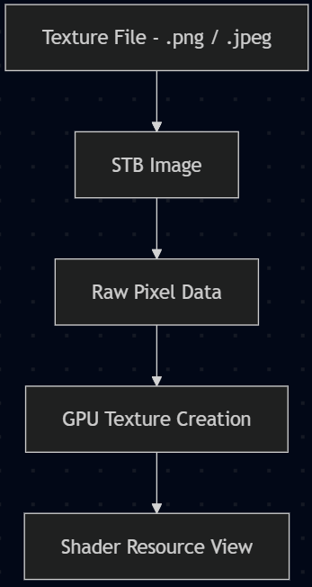

# Texture Loader 
**Author:** Arnas
## Research
When creating the texture loader, there are a couple of good libraries that would work well when creating the sprites for the game objects. This includes DDSTextureLoader <sup>[1](#DDSTextureLoader)</sup>, WICTextureLoader <sup>[2](#WICTextureLoader)</sup>, and STB <sup>[3](#STB)</sup>, based on their performance, format support and cross-platform development. DDSTextureLoader works well for the Windows side of the engine and game due to being compatible with DirectX. A key benefit is supporting textures stored in the GPU-ready formats such as block-compressed DDS files, meaning that the data from the textures can be uploaded to the GPU with minimal processing at runtime. This reduces overhead and improves performance. However, this relies on the DDS file format, which is closely integrated with DirectX, and while efficient, it introduces an additional need for asset conversion. This reduces cross-platform compatibility for non-Windows platforms or different graphic APIs.

Other libraries like WICTextureLoader support more common image formats like .png and .jpeg, making them more suitable for the project's 2D engine. However, textures loaded through it are typically decoded into raw image data at runtime, requiring more processing before being uploaded to the GPU. This increases overhead compared to the pre-compressed formats and impacts performance. Lastly, STB was ultimately selected for its flexibility with the engine scope. It supports a wide range of common image formats, its integrating is lightweight, being a header-only library, and it can operate independently of graphic APIs. Although this doesn't provide the same level of performance as DDSTextureLoader, a dedicated DirectX loader. The ability to decode the images at runtime into raw pixels is flexible and allows the textures to be processed into platform-specific formats before being uploaded to the GPU.

## Implementation
The implementation of the sprite renderer, later renamed to the texture loader, was intended as a texture system manager and could draw sprites. It would load image data, generate GPU resources, and store textures so that game objects could access them later. Before being turned into platform-specific GPU texture resources and shader resource views, textures are imported from the disk file path into raw pixel data. Originally it would only support DirectX 11 and got changed later by another graphic team member to support additional rendering APIs. An example by the ImGui wiki shows an example for importing textures and creating shader resources <sup>[4](#STBExample)</sup> and was used as a guide for the implementation.

During rendering, each game object would reference textures stored within the shader resource view container through an index value. This allowed texture loaded at runtime to be reused across draw calls without repeatedly creating GPU resources, or at least that was the intent. A big advantage of this was the ability to display textures for debugging and editor interfaces without the need for further conversations or systems to be compatible with ImGui.

However, limitations were found in the original implementation. The sprite renderer class has become tightly coupled with DirectX 11 texture management rather than a rendering system. Additionally, the integration with ImGui made separate instances of the sprite renderer and local texture resources for game objects without properly releasing memory. This resulted in duplicated textures and unnecessary memory usage, highlighting weaknesses in the ownership and lifetime management within the system. This all was fixed by the other graphic team member.

<p align="center">
    <a href="../Resources/Images/TextureLoader.png">
        
    </a>
    <br>
    <em>Figure 1: Texture loader overview originally. (Figure is clickable).</em>
</p>

## Comparisons
When comparing to other low-level engines like MonoGame, they do similar logic for their Texture2D resources <sup>[5](#MonoGameTexture2D)</sup> and Sprite class <sup>[6](#MonoGameSprite)</sup>,  but the one created for this engine used an combination of similar logic. As an example, the draw call for MonoGame has a texture, which can be loaded into, and has a sprite (game object), which takes in the graphics device of the renderer <sup>[7](#MonoGameDraw)</sup>. This is an example from MonoGame of how textures are loaded:
```c++
// The reference to the loaded sprite
private Texture2D spriteTexture;
// The position to draw the sprite
private Vector2 spritePosition;

protected override void LoadContent()
{
    // Create a new SpriteBatch, which can be used to draw textures.
    _spriteBatch = new SpriteBatch(GraphicsDevice);
    spriteTexture = Content.Load<Texture2D>("Character");
    spritePosition = Vector2.Zero;
}
```
Going a bit furthur is the sample of the draw call: 
```c++
protected override void Draw(GameTime gameTime)
{
    GraphicsDevice.Clear(Color.CornflowerBlue);

    // TODO: Add your drawing code here
    _spriteBatch.Begin();
    _spriteBatch.Draw(spriteTexture, spritePosition, Color.White);
    _spriteBatch.End();

    base.Draw(gameTime);
}
```
This is different from the engine since our texture manager takes in the device for the loading in of the textures. After the texture is loaded from disc into the data buffer, it is then used for creating a temporary Texture 2D, which is needed for the shader resource view. This is then set for the game object, which can be changed to other textures since it gets the texture ID of the current object for each draw call.

## Conclusions
The selection for texture loading needed to account for flexibility and cross-platform considerations. While libraries like DDSTextureLoader provided optimised loading through GPU-ready compressed texture formats, their reliance on DDS files reduces portability and flexibility. Similarly, WICTextureLoader did allow for more common image formats but lacked the performance benefits of GPU-ready compressed texture formats.

In contrast, the STB library seemed to be the perfect solution for the scope of the project. It had the ability to load/write to multiple image formats, combined with the lightweight integration and cross-platform capabilities. It aligned well with creating a flexible and extensible system. Although this did sacrifice some performance compared to using something like the DDSTextureLoader, it enabled cleaner abstraction between engine and platform-specific graphics APIs. The implementation showed how simple and adaptable it is by loading textures only into raw pixel data that can be converted to GPU resources at runtime, making it compatible with different rendering backends while maintaining the required performance. Lastly, for the scale of the engine and the simplicity of the 2D games/demos, the additional runtime decoding overhead was considered acceptable compared to the flexibility gained.

## References: 
<a id="DDSTextureLoader">1</a>: Github.com. (2026). DirectXTK. [online] Available at: https://github.com/microsoft/DirectXTK/wiki/DDSTextureLoader. 

<a id="WICTextureLoader">2</a>: microsoft (2025). WICTextureLoader. [online] GitHub. Available at: https://github.com/microsoft/DirectXTK/wiki/WICTextureLoader.  

<a id="STB">3</a>: Barrett, S. (2021). nothings/stb. [online] GitHub. Available at: https://github.com/nothings/stb. 

<a id="STBExample">4</a>: ocornut (2023). Image Loading and Displaying Examples. [online] GitHub. Available at: https://github.com/ocornut/imgui/wiki/Image-Loading-and-Displaying-Examples/3fc5ed67ff0546b8119f534bbcd05fbedc355698.   

<a id="MonoGameTexture2D">5</a>: Monogame.net. (2026). Class Texture2D | MonoGame. [online] Available at: https://docs.monogame.net/api/Microsoft.Xna.Framework.Graphics.Texture2D.html#Microsoft_Xna_Framework_Graphics_Texture2D_FromStream_Microsoft_Xna_Framework_Graphics_GraphicsDevice_Stream_.

<a id="MonoGameSprite">6</a>: Monogame.net. (2026). Chapter 08: The Sprite Class | MonoGame. [online] Available at: https://docs.monogame.net/articles/tutorials/building_2d_games/08_the_sprite_class/index.html. 

<a id="MonoGameDraw">7</a>: Monogame.net. (2026). Drawing a Sprite | MonoGame. [online] Available at: https://docs.monogame.net/articles/getting_to_know/howto/graphics/HowTo_Draw_A_Sprite.html. 

[<- Back to Overview](../GraphicsOverview.md)