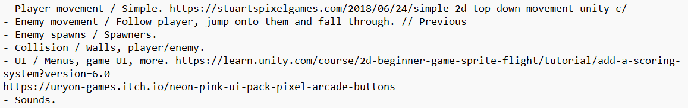

/* <a href="{{ '/blogs/' | relative_url }}" class="btn">📰 All Blogs</a> */
### Overview
While I have attempted at doing game jams before they never fully worked out and this was my first one where I was able to plan, implement and publish on time. Only finding about it the same day and with 5 hours to do it. Thankfully while I couldn’t plan too much, I was able to think of an idea while I was taking care of other responsibilities in the morning. An idea of a game where you dodge enemies while they attack the player isn’t unique fundamentally, but with limited time it worked perfectly at doing this specific game jam.

### Plans

    
     
    <em>Figure 1: Showing the initial plans with links to resources. (Figure is clickable).</em>

### Movement
Taking the list as priority, I needed to have movement done for both player and enemies. This isn’t a new concept but wanted to quickly look into possible options for 2D movement in Unity and while the input system would’ve been a better modern alternative, in the end I stuck with the classic of getting an inputs raw axis.  A guide by Stuart goes into a simple 2D movement system[1](#2DMovement) and doesn’t seem any different from what I had done before.  

When it came to enemy movement since it was about targeting the player, the built in Vector2 function MoveTowards was perfect. This allowed the enemy position to move towards the player position using in game ticks and that was if the enemy wasn’t too close to the player. On the other hand, if they were then a coroutine called dash towards would start. Inside it was mostly the same with the enemy waiting a bit before dashing and dying, later improvements to this was changing colours and adding score upon death. 

    
     
    <em>Figure 2: Showing the enemy's update and logic for movement based decision. (Figure is clickable).</em>

<table align="center">
  <tr>
    <td align="center" valign="middle" style="width: 40%;">
      
    </td>
    <td align="center" valign="middle" style="width: 60%;">
      
    </td>
  </tr>
  <tr>
    <td colspan="2" align="center">
       
      <em>Figure 3: This is the enemy waiting and switching between colours. (Figure is clickable).</em>
    </td>
  </tr>
</table>

### Collisions

### Visuals

<h3>Entry</h3>
This was the summited entry I did for gamebridge 2026 game jam.
<iframe frameborder="0" src="https://itch.io/embed/4657786?bg_color=505050&amp;fg_color=ffffff&amp;link_color=fa5c5c&amp;border_color=505050" width="552" height="167"><a href="https://arnas-code.itch.io/endless-dodge">Endless Dodge by Arnas-Code</a></iframe>

### References
<a id="2DMovement">1</a>: Stuart’s Pixel Games. (2018). How To Do 2D Top-Down Movement – Unity C#. [online] Available at: https://stuartspixelgames.com/2018/06/24/simple-2d-top-down-movement-unity-c/.