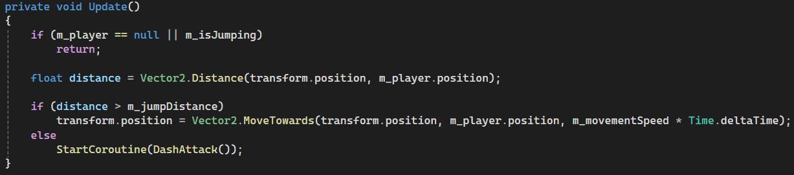
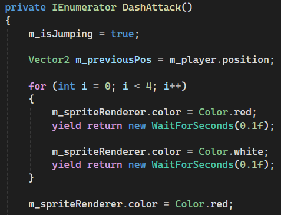
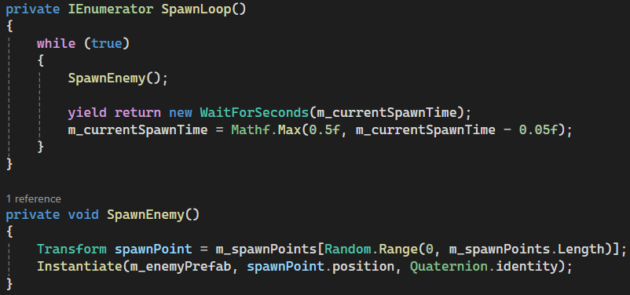
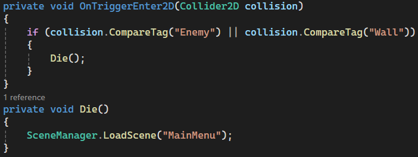
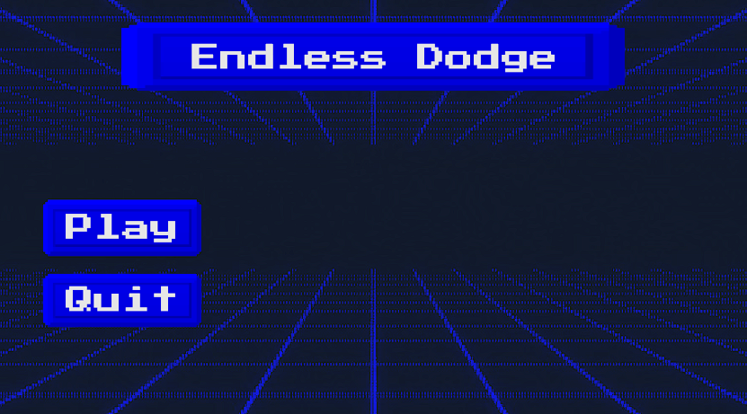
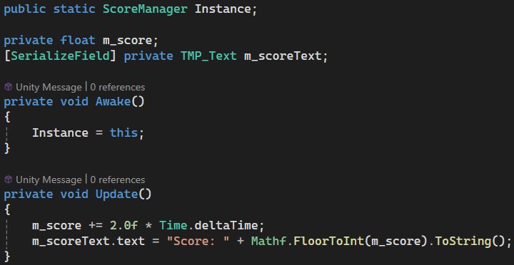

### Overview
While I have attempted past game jams before they never fully worked out and this was the first one where I was able to plan, implement and summit on time for Gamebridge Game Jam 2026. Only finding about it the same day and with 5 hours to do it due to other responsibilities in the morning, I had to quickly plan what I wanted this game to be. An idea of dogeing enemies while they attack the player wasn’t a fundamentally unique idea but worked within the limited time I had for this game jam.  

---
### Plans for the Game

    
     
    <em>Figure 1: This was what my initial notepad had with some links as I went along and the order of priority for the game. (Figure is clickable).</em>

---
### Movement for Player and Enemy
First on the list was movement for both player and enemies. This was a basic concept seen in many games, but I quickly looked at different types of movements I could do and their related systems. While the modern input system by Unity would’ve been a better choice long term with its varying input support, I on the other hand went with a basic get raw axis date and move the position in that direction based on key input. A guide by Stuart Pixel Games[1](#2DMovement) goes over that perfectly with simple 2D movement and isn’t really any different from what I have done before. 

Since the enemies wouldn’t be controlled like the player, having them move towards their position was enough through getting player position, enemy position and delta time. However, if the enemy was within a certain distance to the player they would stop and start a dash attack function, inside this function it would wait, change colours, dash and die.  

    
     
    <em>Figure 2: Showing the enemy's update and logic for movement based decision. (Figure is clickable).</em>

<table align="center">
  <tr>
    <td align="center" valign="middle" style="width: 50%;">
      
    </td>
    <td align="center" valign="middle" style="width: 50%;">
      
    </td>
  </tr>
  <tr>
    <td colspan="2" align="center">
       
      <em>Figure 3: This is the enemy waiting, switching between colours and dashing to the player previous known position. (Figure is clickable).</em>
    </td>
  </tr>
</table>

---
### Spawner and Collisions 
For the enemy spawner I had four preset locations that it could go between and instantiate would spawn the enemies at said locations. Problem with this is that there is a lot of creating and destroying, a better method would be to have an enemy object pool that it would pull from.  

    
     
    <em>Figure 4: This was the code for spawning infinite number of enemies with it slowly speeding the number of enemies spawned. (Figure is clickable).</em>

The collisions were done quickly using tags for enemy and wall where necessary, before being checked inside the player script.

    
     
    <em>Figure 5: When colliding with an enemy or wall it would send the player back to main menu. (Figure is clickable).</em>

---
### Visuals (UI, sprites and background)
This section I’ll briefly talk about my design philosophy I had in mind for the game since the beginning and that was an arcade 80s art style since I needed something simple, while also trying to make it look as good as possible. For the player and enemy sprites, I went with a basic square and different colour for them. Then for stuff like UI, I used the button assets by Uryon Games[2](#Buttons) and gotten background images online that matched everything nicely. Lastly used an arcade font that I found, which is pixel like. For the scoring system Unity learning courses[3](#Scoring) gave what I needed initially and then added stuff from there. From doing the scoring system I learned how Unity does their instances since I only ever done it in C++. 

    
     
    <em>Figure 6: What I did for the main menu of the game. (Figure is clickable).</em>

    
     
    <em>Figure 7: This shows a snippet of the scoring manager like how it is set up, and how score is always getting added. (Figure is clickable).</em>

---
### Sounds
For sounds since I wanted an older arcade feel to the game I went with some techno music that fit by Neon Pulse[4](#Music). 
This sound was used for gameplay music:
<audio controls>
  <source src="GameMusic.ogg" type="audio/ogg">
  Your browser does not support the audio element.
</audio>

This sound was used in the main menu:
<audio controls>
  <source src="MenuMusic.ogg" type="audio/ogg">
  Your browser does not support the audio element.
</audio>

---
### Entry
This was the summited entry I did for gamebridge 2026 game jam.
<iframe frameborder="0" src="https://itch.io/embed/4657786?bg_color=505050&amp;fg_color=ffffff&amp;link_color=fa5c5c&amp;border_color=505050" width="552" height="167"><a href="https://arnas-code.itch.io/endless-dodge">Endless Dodge by Arnas-Code</a></iframe>

--- 
### Final Notes + Gameplay trailer
There was still a lot I wanted to do even with the limited time like adding more sound effects, different enemy types, but with time not being in my favour I had to compromise. While a lot of the features in my head would’ve made the game better, I really wanted to look into shaders for Unity and would’ve been good in having a moving background instead of a static image in the background. This especially would’ve looked good on the characters since I forgot to add anything for them. Overall, I had a nice time doing the game jam and was a good experience in managing my time.  

    <iframe
      src="https://www.youtube.com/embed/51c2vUMaUpU"
      title="Gameplay Trailer" frameborder="0" allowfullscreen style="width: 100%; height: 400px;">
    </iframe>

---
### References
<a id="2DMovement">1</a>: Stuart’s Pixel Games. (2018). How To Do 2D Top-Down Movement – Unity C#. [online] Available at: https://stuartspixelgames.com/2018/06/24/simple-2d-top-down-movement-unity-c/.

<a id="Buttons">2</a>: itch.io. (2026). Neon Pink UI Pack – Pixel Arcade Buttons – Uryon Games [online] Available at: https://uryon-games.itch.io/neon-pink-ui-pack-pixel-arcade-buttons.

<a id="Scoring">3</a>: Unity Learn. (2026). Add a scoring system. [online] Available at: https://learn.unity.com/course/2d-beginner-game-sprite-flight/tutorial/add-a-scoring-system?version=6.0.

<a id="Music">4</a>: itch.io. (2026). Free Action Arcade Music Pack – Neon Pulse. [online] Available at: https://soma-animus.itch.io/arcade-music-pack-neon-pulse.