# Overview
This was my first time doing a game jam in a group to completion. Not too long ago I did my first game jam to completion by myself for Gamebridge 2026 in five hours, which can be read here [GameBridge2026]({{ '/blogs/2026-07-15-MyFirstGameJam/index.html' |  relative_url }}). This goes over my thoughts as I went through the project trying to include everything needed for a game. For this project I mostly was responsible for shader related work and minor scripting. 

---
# Rendering pipelines and Web build
The project brief stated that the game could either be an windows executable or a web html build. Since that was the case we used the universal rendering pipeline for its compatibility with web-based projects[[1]](#PipelineComparison)[[2]](#ChoosingPipeline) and our low poly game. For the web builds I oversaw updating our itch page with a new build everyday and did some profiling to check if there were any problems. While unity is fairly explanatory in how to do web builds, having experience with doing them at a lower level helped understand how they work. 

Since this was my first time doing web builds for unity I read up on their documentation from WebGL performance and what to look out for[[3]](#WebGLPerformance), to how I could optimise the build[[4]](#WebOptimising), and how to do web builds[[5]](#UnityWeb). During the project I would do the builds manually, which was a problem due to them talking a while and this was even more apparent of a problem nearing the deadline. A better method would’ve been doing automated web builds[[6]](#AutomatedBuilds).

## The first build
The first web build took 30 minutes to do, but I was able to check that inputs and everything else was working. I then used this build to set up the itch page.
<table align="center">
  <tr>
    <td align="center" valign="middle" style="width: 40%;">
      <a href="FirstBuildObjects.png"> 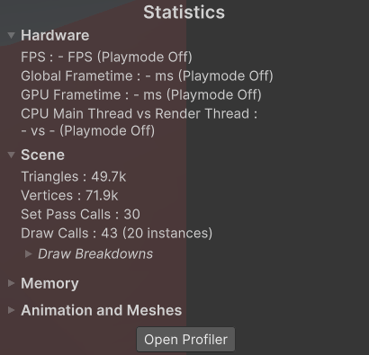 </a>
    </td>
    <td align="center" valign="middle" style="width: 60%;">
      <a href="FirstWebBuild.gif"> 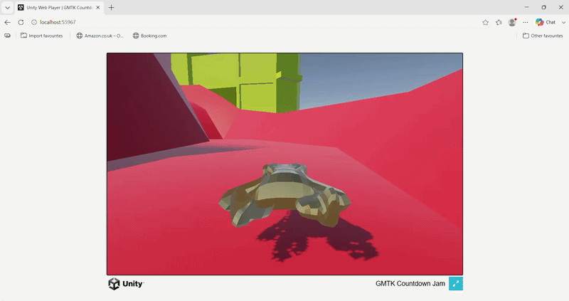 </a>
    </td>
  </tr>
  <tr>
    <td colspan="2" align="center">
       
      <em>Figure 1: The first is an image showing the draw calls at the time, while the second is a gif showing it working locally online. (Figures are clickable).</em>
    </td>
  </tr>
</table>

This continued as the days went on and even did a devolvement build so I could profile the scene. 

    <a href="DevBuildProfile.png"> 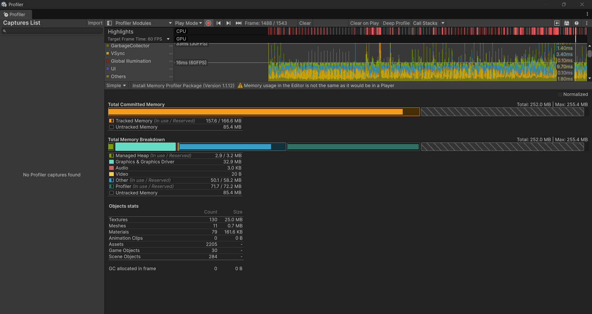 </a>
     
    <em>Figure 2: A frame being profiled, which from my understanding seems to be at a steady 60 fps with no garbage allocations. (Figure is clickable).</em>

# Shaders and Effects
## Shader graphcs
The project was a good opportunity to look into graphics for Unity, it being my first time I went to unity’s documentation to understand. At first, I did use unity’s documentation to understand[[7]](#EmissionShaders), but it didn’t explain in enough detail or stuff to look out for and would have worked better if I used the tutorial files. A YouTube video by LlamAcademy[[8]](#ShaderGraphTuorial) explained it more in depth and even gave examples. Later I used a discussion post to get a pulse effect[[9]](#PulseEffect).

    <a href="ThreeEffects.gif"> 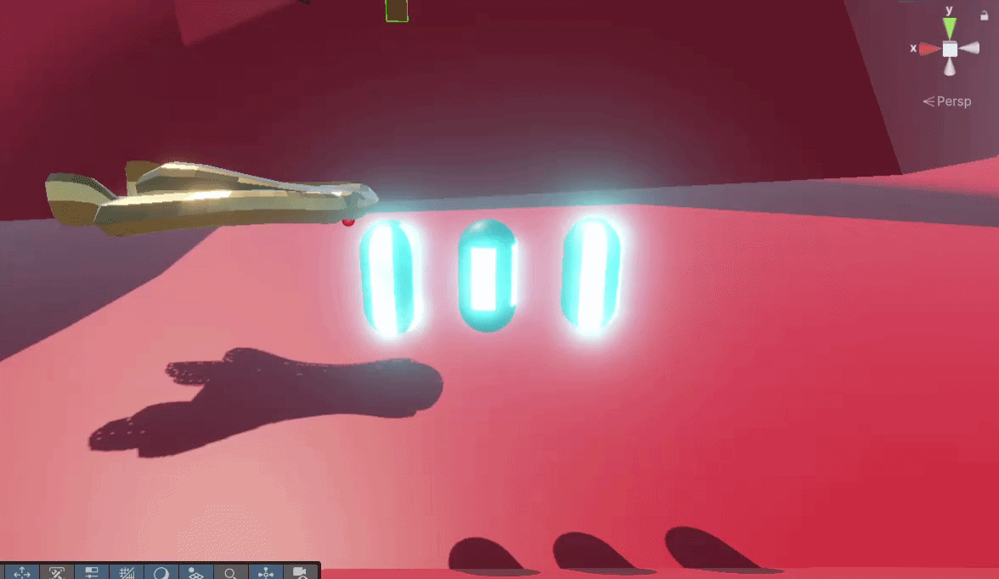 </a>
     
    <em>Figure 3: Some of the experimental effects I created to not only learn and would’ve been used on the car. (Figure is clickable).</em>

## Post processsing
Once done with shaders, I wanted to look into what post processing effects could be done for the game since we had acceleration and a boosting mechanic. Using a volume profile, I added chromatic aberration, which gives the illusion of being filmed through a lens[[10]](#ChromaticAberration). Initially this was done for experimentation and was liked by the team, but was suggested to be more intense with additional effects. 

In the end I continued adding more and more but needed a way to weigh these effects based on the player speed and wasn’t enough to just be put into the scene, since it would be always affected without a way to lower the intensity, so I created a small system that would work for it. This included a distortion controller, this would handle the scripting of the effects and a distortion volume, which would have the volume profile attached to it. 
<table align="center">
  <tr>
    <td align="center" valign="middle" style="width: 60%;">
      <a href="DistortionCode.png"> 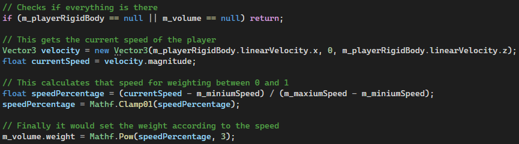 </a>
    </td>
    <td align="center" valign="middle" style="width: 40%;">
      <a href="DistortionEffect.gif"> 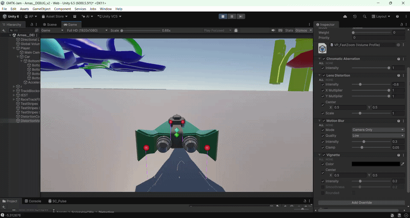 </a>
    </td>
  </tr>
  <tr>
    <td colspan="2" align="center">
       
      <em>Figure 4: The first image is the code, which applies a weighting between 0 and 1 to the volume profile based on the player speed. While the gif is the development video I took for the group to get feedback. (Figures are clickable).</em>
    </td>
  </tr>
</table>

## Particles
We had acceleration, we had post processing effects associated with it, but what we needed now was even more visual cues with speed to make a more impactful experience like particles. This was something I mostly experimented with due to having experience already with stuff like it. 

    <a href="Particles.gif"> 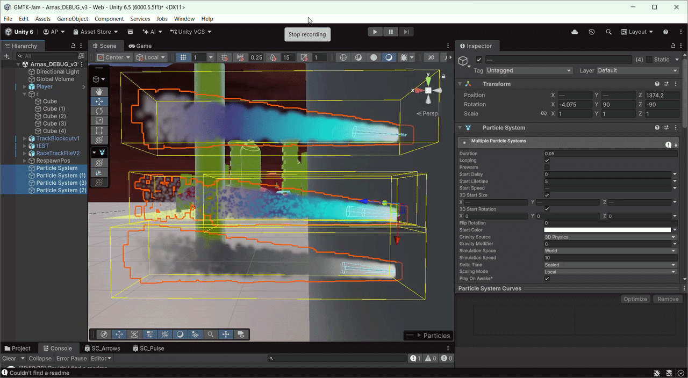 </a>
     
    <em>Figure 5: This is the development video of particles that I did quickly while experimenting to show the team and get their thoughts. (Figure is clickable).</em>

## Fake fog
Originally attempted by another teammate who passed this task to me was creating a fog layer to disguise the fact that we are floating in the middle of nowhere. Using the same guide by Vanmillion Studios[[11]](#FakeFog), I was able to replicate some of the effect, but quickly realised that it doesn’t work for our intent and with no time to do something else stuck through with it.

    <a href="FakeFogImage.png"> 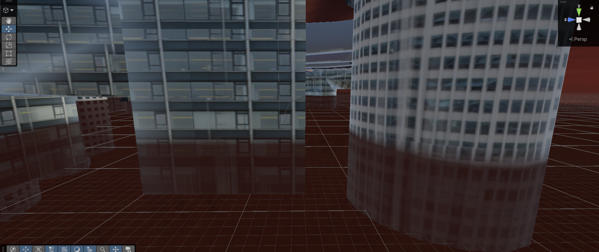 </a>
     
    <em>Figure 6: The image shows some blending, but would definitely go with something else the next time. (Figure is clickable).</em>

---
# Extra
Some extra work I did for the game was creating an arrow shader effect and the racing line effect plus code. For the effects I have enough experience now to create them, and then wrote a small piece of code that would update how many laps were done, displaying them and the win condition.

    <a href="GlowArrows.gif"> 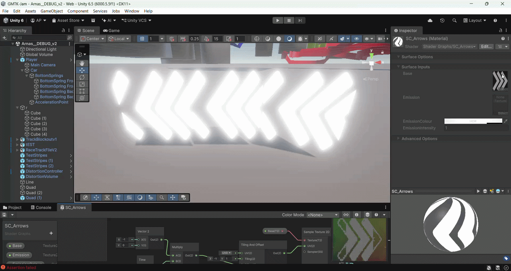 </a>
     
    <em>Figure 7: This was put in the game around areas where it wasn't as obvious where to turn so you don't drive off and in the final product the glow emission was lowered upon getting feedback.. (Figure is clickable).</em>

<table align="center">
  <tr>
    <td align="center" valign="middle" style="width: 50%;">
      <a href="LapsCode.png"> 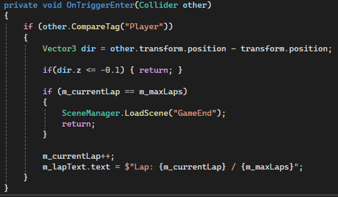 </a>
    </td>
    <td align="center" valign="middle" style="width: 50%;">
      <a href="BarrierImage.png"> 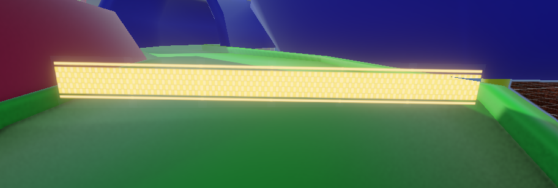 </a>
    </td>
  </tr>
  <tr>
    <td colspan="2" align="center">
       
      <em>Figure 8: The first image has code, which I did besides the checking direction done by another teammate and the other image was the effect created, which had a collider for the code to use. (Figures are clickable).</em>
    </td>
  </tr>
</table>

---
# Final 
The submission day like always is stressful, trying to put together everything that is needed for builds that take a while to do. For my part everything was included besides the initial shaders due to time constraints and other priorities at the time. There were also the arrows that I created, which couldn't be put in enough spots due to again not enough time near the end. However, besides that I overall had a great time with the team, this included:

Tyler Wood - [Portfolio](https://donk-e.github.io) [LinkedIn](https://www.linkedin.com/in/tyler-wood-29aba6362/) 

Jemina Banu - [Portfolio](https://jem-exe.github.io) [LinkedIn](https://www.linkedin.com/in/jemina-banu-5557a9261/) 

Jaida Banga - [ArtStation](https://jaidadevi.artstation.com) [LinkedIn](https://www.linkedin.com/in/jaida-banga-5604b7223/) 

Cemal Hussein - [ArtStation](https://cemhussein.artstation.com) [LinkedIn](https://www.linkedin.com/in/cemal-hussein-1879a9388/) 

## Entry
[Rating Page](https://itch.io/jam/gmtk-jam-2026/rate/4813892) or the game: 

  <iframe frameborder="0" src="https://itch.io/embed/4813892?dark=true" width="552" height="167"><a href="https://arnas-code.itch.io/pulsedrive">Pulse Drive by Arnas-Code, Donk-e, Jemi.exe</a></iframe>

---
### References
<a id="PipelineComparison">1.</a> UnityDocs. Render Pipelines Comparison. [online] Available at: [https://docs.unity3d.com/6000.5/Documentation/Manual/render-pipelines-feature-comparison.html](https://docs.unity3d.com/6000.5/Documentation/Manual/render-pipelines-feature-comparison.html).

<a id="ChoosingPipeline">2.</a> UnityDocs. Choosing the correct render pipeline. [online] Available at: [https://docs.unity3d.com/2022.3/Documentation/Manual/choose-a-render-pipeline.html](https://docs.unity3d.com/2022.3/Documentation/Manual/choose-a-render-pipeline.html).

<a id="WebGLPerformance">3.</a> UnityDocs. WebGL Performance. [online] Available at: [https://docs.unity3d.com/6000.5/Documentation/Manual/webgl-performance.html](https://docs.unity3d.com/6000.5/Documentation/Manual/webgl-performance.html).

<a id="WebOptimising">4.</a> UnityDocs. Web Optimising. [online] Available at: [https://unity.com/how-to/profile-optimize-web-build#responsive-design](https://unity.com/how-to/profile-optimize-web-build#responsive-design).

<a id="UnityWeb">5.</a> UnityDocs. Unity Web. [online] Available at: [https://learn.unity.com/tutorial/getting-started-with-unity-web ](https://learn.unity.com/tutorial/getting-started-with-unity-web).

<a id="AutomatedBuilds">6.</a> UnityDocs. Build Automation. [online] Available at: [https://docs.unity.com/en-us/build-automation](https://docs.unity.com/en-us/build-automation).

<a id="EmissionShaders">7.</a> UnityDocs. Add Emission Shaders. [online] Available at: [https://learn.unity.com/course/2d-lighting-for-pixel-art/tutorial/add-emission-shaders](https://learn.unity.com/course/2d-lighting-for-pixel-art/tutorial/add-emission-shaders).

<a id="ShaderGraphTuorial">8.</a> LlamAcademy. 3 Twinkling Emissive Light Shaders | ShaderGraph Unity Tutorial. [online] 
Available at: [https://www.youtube.com/watch?v=dkLUQ6XJVS0](https://www.youtube.com/watch?v=dkLUQ6XJVS0).

<a id="PulseEffect">9.</a> Unity Technologies. Shader graph - quick pulsating light? [online] 
Available at: [https://discussions.unity.com/t/shader-graph-quick-pulsating-light/705307/9](https://discussions.unity.com/t/shader-graph-quick-pulsating-light/705307/9).

<a id="ChromaticAberration">10.</a> Unity Learn. Post Processing Effects: Chromatic Aberration. [online] 
Available at: [https://learn.unity.com/tutorial/post-processing-effects-chromatic-aberration](https://learn.unity.com/tutorial/post-processing-effects-chromatic-aberration).

<a id="FakeFog">11.</a> Vanmillion Studios. Vertical Volumetric Fog in Unity : Hypercasual Game Development in Unity 6. [online] 
Available at: [https://www.youtube.com/watch?v=-s7_l3TXWPM](https://www.youtube.com/watch?v=-s7_l3TXWPM).

<!-- Back -->
<section class="project-content">
  <a href="{{ '/' | relative_url }}" class="project-button"> ← BACK TO HOME </a>
  <a href="{{ '/blogs/' | relative_url }}" class="project-button"> ← BACK TO BLOGS </a>
</section>