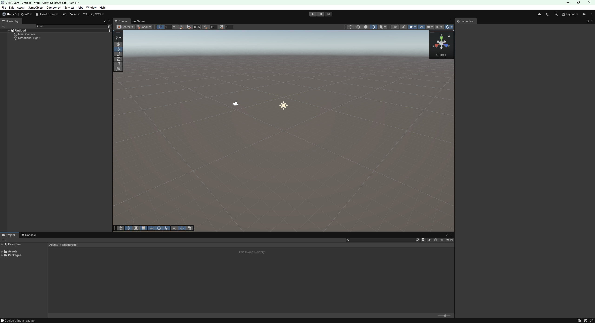
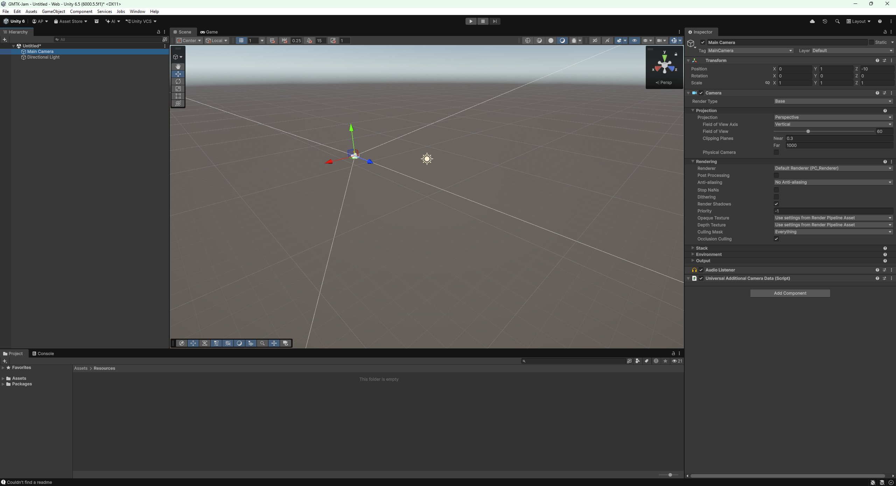
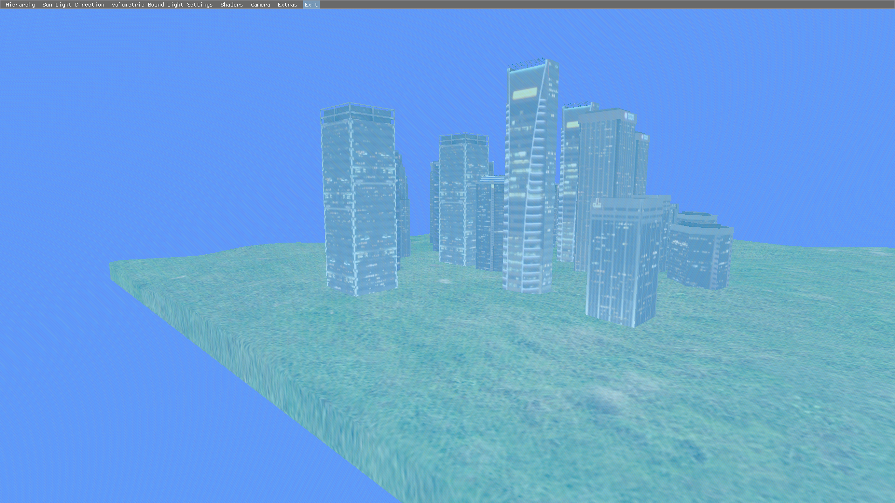
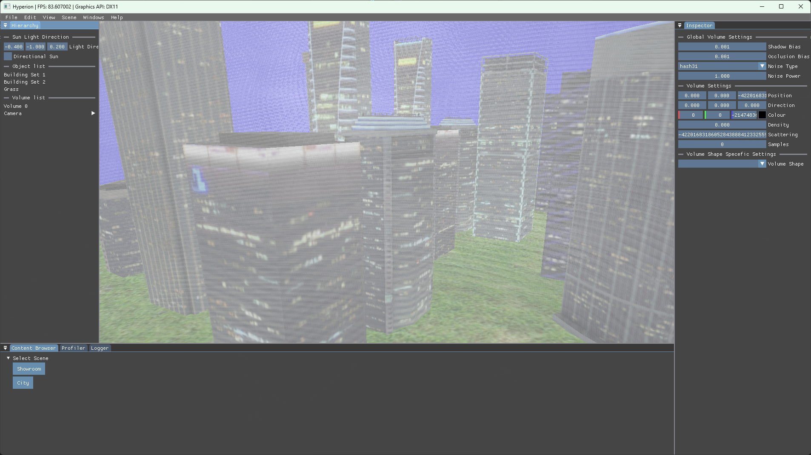

# Overview
At this point in the project, I felt that the UI needed some overhauling for not only now and separating its different systems into easier to access places, but also this would be beneficial in the future where I continue to add said systems. This was good to have at this point since it also helped me see some fundamental problems with some of the systems.

# UI inspiration
For the task I mostly looked around at inspiration from Unity’s UI and looked at some of the documentation from the wiki for ImGui related code on GitHub [view docking example](https://github.com/ocornut/imgui/wiki/docking). 
<table align="center">
  <tr>
    <td align="center" valign="middle" style="width: 50%;">
      
    </td>
    <td align="center" valign="middle" style="width: 50%;">
      
    </td>
  </tr>
  <tr>
    <td colspan="2" align="center">
       
      <em>Figure 1: These images show of Unity UI examples I was talking about. (Figures are clickable).</em>
    </td>
  </tr>
</table>

# Results
Since its mostly skimming through to maybe understand more the concept or what specific terminology to use there wasn’t really a lot of reading through properly, but I still feel like it was a major improvement visually and cleaned up some code internally.
<table align="center">
  <tr>
    <td align="center" valign="middle" style="width: 50%;">
      
    </td>
    <td align="center" valign="middle" style="width: 50%;">
      
    </td>
  </tr>
  <tr>
    <td colspan="2" align="center">
       
      <em>Figure 2: These images visually show some of the differences I made to the UI. (Figures are clickable).</em>
    </td>
  </tr>
</table>