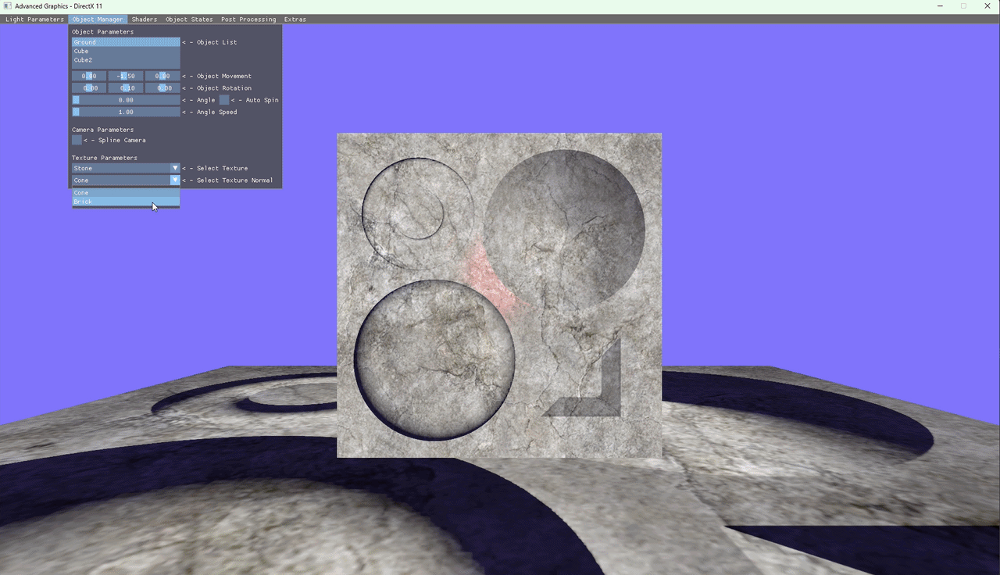
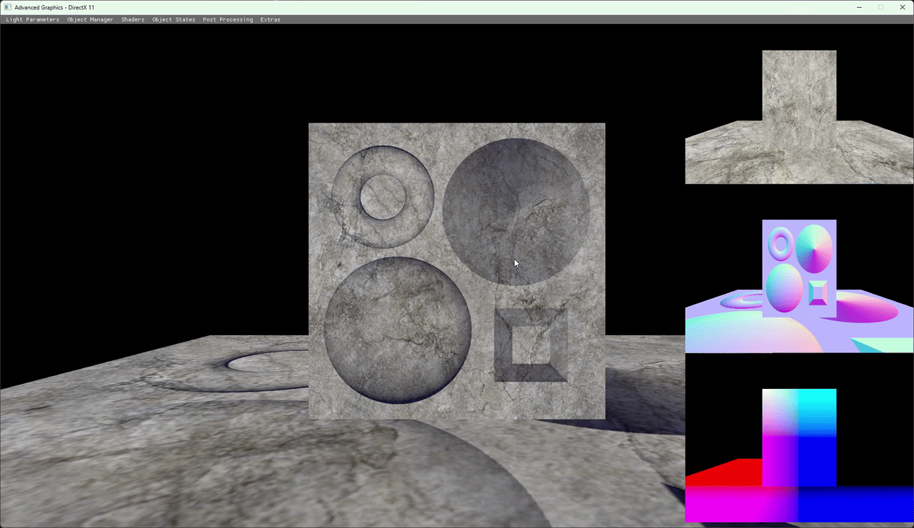
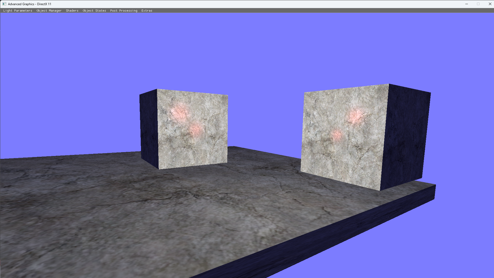
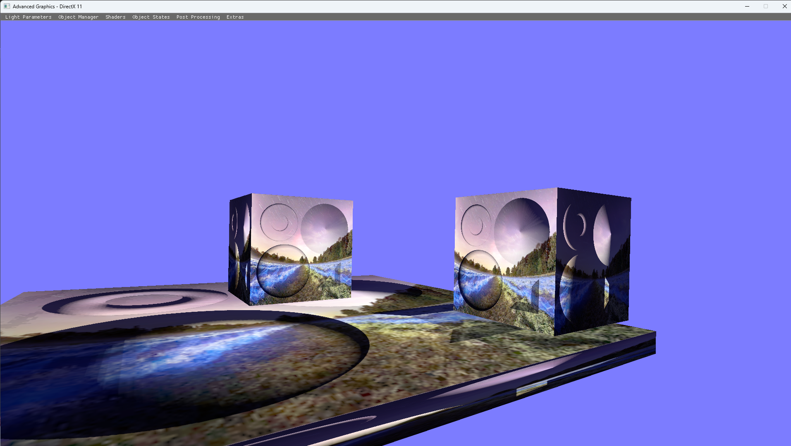
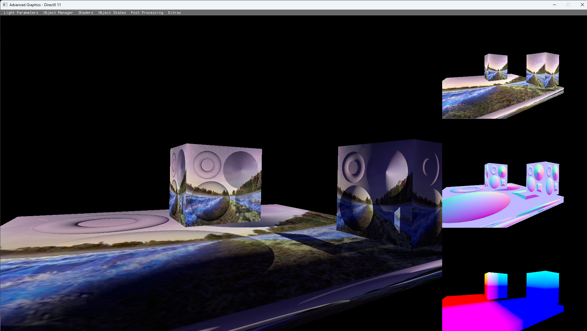
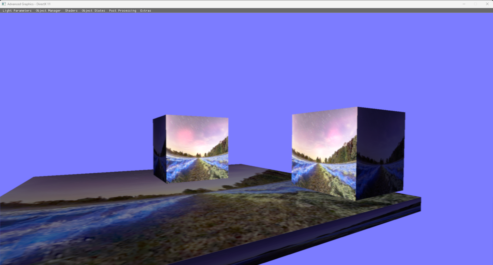
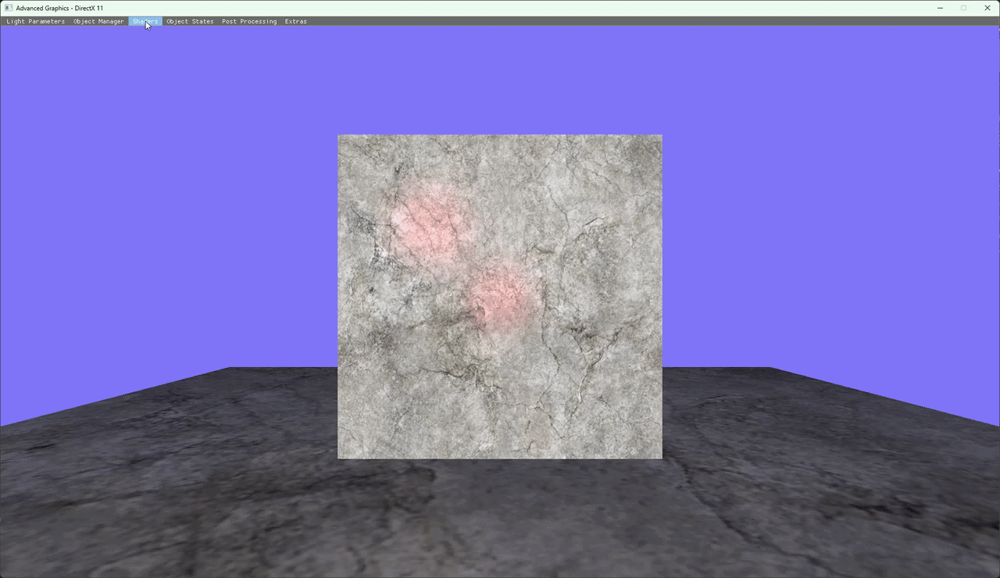
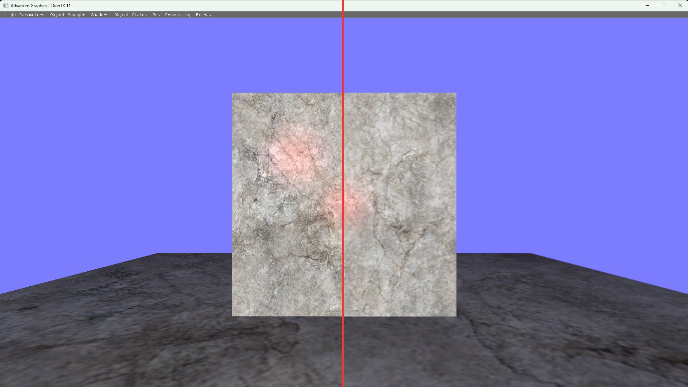

<!-- Gallery Section -->
<section class="project-gallery">

  <!-- Slide 1 -->
  

    <iframe src="https://www.youtube.com/embed/YlJKgl5t5rQ" title="Demo Trailer"
      frameborder="0" allowfullscreen>
    </iframe>
  

  <!-- Slide 2 -->
  

    
  

  <!-- Slide 3 -->
  

    
  

  <!-- Slide 4 -->
  

    
  

<!-- Navigation -->
<button class="prev" onclick="plusSlides(-1)" aria-label="Previous slide">❮</button>
<button class="next" onclick="plusSlides(1)" aria-label="Next slide">❯</button>

<!-- Caption -->

 

 

  <!-- Thumbnails -->
  

    

      
    

    

      
    

    

      
      

    

      
    

  

</section>
  
<!-- Overview -->
<section class="project-content">
  
// OVERVIEW

  
In this project I explored different 3D rendering techniques like Render to Target (RTT), created different shaders like normals, used graphic profiling to debug my graphics pipeline, and used ImGui to change settings at runtime.

</section>

<!-- Key Features -->
<section class="project-content">
  
// KEY FEATURES

  

    

      <h3>Scene Manipulation</h3>
      
Aimed to create an interactive program through ImGui. Using it for ease of accessing lights and objects through managers.

    

    

      <h3>Shaders</h3>
      
Implemented multiple shaders like standard, normals, deferred, hull and post-processing to handle varying logic from how the object interacts with the world to screen passing for post-processing.

    

    

      <h3>Profiling</h3>
      
Using graphic profilers like RenderDoc to debug rendering passes. One instance of this was for the G-buffer for the deferred shader.

    

  

</section>

<!-- Technical Breakdown -->
<section class="project-content" id="memorytracker">
  
// TECHNICAL BREAKDOWN

  <h2></h2>
  <h3>Scene Manipulation</h3>
  
The scene manipulation in this had light, which would allow the user to manipulate its parameters that change the ID, position, colour, materials colours and more. While the object had parameters that changed where it was, the texture was applied at runtime, and it had a spline camera. There were other variables that could be set at runtime, like the shader, post processing effects and minor other visuals. For improvements, this could have pickable objects with a mouse and more visual aid, like where the light positions are with a gizmo.

  

    
     
    <em>This shows of some the custom parameters that can be changed. (Figure is clickable).</em>
  

  <h3>Shaders</h3>
  
For the purposes of this project, I created different shaders to do different logic. First I had a shader, which only put it correctly into world space, and then applied the texture to the cube with lighting. Then for the normal shader instead of passing normals to the light like the standard shader, I would pass in a bump map, but this wouldn't be enough since it needs tangent space for the normals to interact with the surface. There were also shaders for post-processing, which would do different visual effects over screen space. Something extra I did was doing tessellation through a hull and domain shader, which created extra triangles through the shader. This would add detail and not be as computational heavy when doing higher definition models. Lastly, a major shader was deferred, which would create a g-buffer to store three sets of textures of the scene. One for ambient, normal and world space. It is common to have depth or maybe even specular, but it depends on the needs of it.

  

    
     
    <em>This shows the multiple created shaders for the project. (Figure is clickable).</em>
  

  <h3>Post Processing</h3>
  
For post-processing I did Render to Target (RTT) to get a texture from the render pass of the scene. This would get applied to a cube at first, but later on for a fullscreen pass, I did a quad across the screen that got the texture. For an upgrade, this could've been one big triangle since that would be more optimised, and while I didn't encounter it, doing two triangles tends to give a seam line where they are crossing. For the first texture applications to the screen, I did a greyscale across:

  

    <pre><code>
float4 vColor = txDiffuse.Sample(samLinear, IN.Tex);
float gray = dot(vColor.rgb, float3(0.299, 0.587, 0.114));
vColor.rgb = gray;
return vColor;
    </code></pre>
  

  
To show other functionality of this, I created a box blur, which would offset the texture pixels by a minor degree, and then did a depth blur, which depending on distance, would be more clear or not.

  

    
     
    <em>This shows of the box blur effect through post processing. Left being standard shader while the right have blur on. (Figure is clickable).</em>
  

</section>

<!-- Back -->
<section class="project-content">
  <a href="{{ '/' | relative_url }}" class="project-button"> ← BACK TO HOME </a>
  <a href="{{ '/pages/projects.html' | relative_url }}" class="project-button"> ← BACK TO PROJECTS </a>
</section>