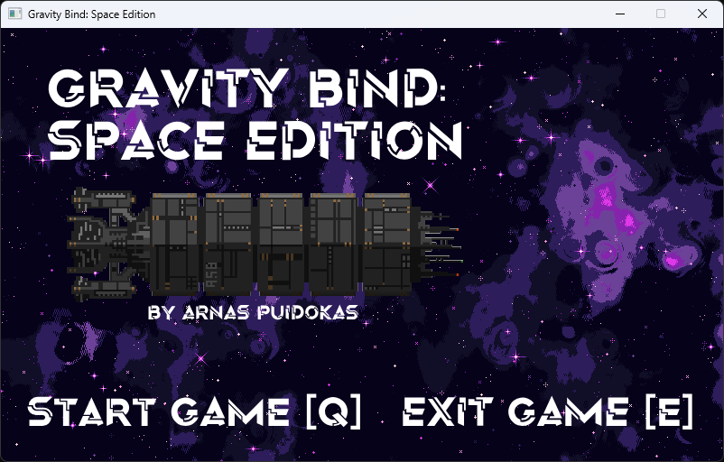
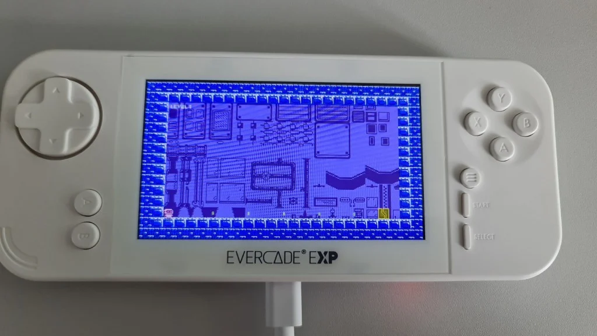
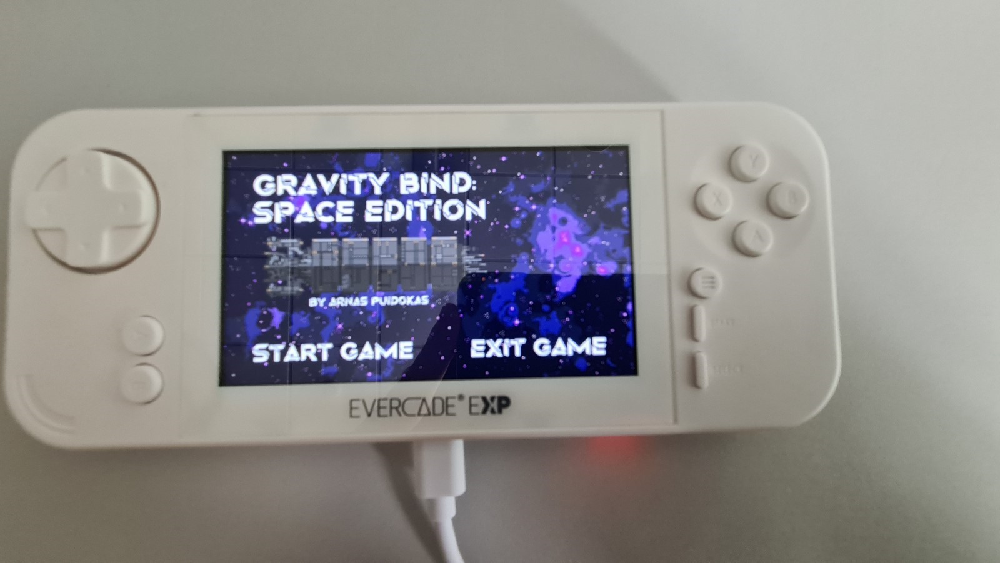

<!-- Gallery Section -->
<section class="project-gallery">

  <!-- Slide 1 -->
  

    <iframe src="https://www.youtube.com/embed/gguMz9gUZwM" title="Windows Demo Trailer"
      frameborder="0" allowfullscreen>
    </iframe>
  

  <!-- Slide 2 -->
  

    <iframe src="https://www.youtube.com/embed/KOD4hRejCro" title="Evercade Demo Trailer"
      frameborder="0" allowfullscreen>
    </iframe>
  

  <!-- Slide 3 -->
  

    
  

  <!-- Slide 4 -->
  

    
  

<!-- Navigation -->
<button class="prev" onclick="plusSlides(-1)" aria-label="Previous slide">❮</button>
<button class="next" onclick="plusSlides(1)" aria-label="Next slide">❯</button>

<!-- Caption -->

 

 

  <!-- Thumbnails -->
  

    

      
    

    

      
    

    

      
    

    

      
    

  

</section>

<!-- Overview -->
<section class="project-content">
  
// OVERVIEW

  
During this project I created a game that was ported to the Evercade after following the proper procedure when creating a game. This included a research period, development period and porting period. It taught me how to investigate game design principles and project management, which without I wouldn’t have been able to create a fully fledge out game that was ported. Common struggles involved were porting to Evercade since it wasn’t as simple as pressing a couple of buttons and having worked on it so much throughout the period of the project, I devised my own method of step by step that always worked.

</section>

<!-- Key Features -->
<section class="project-content">
  
// KEY FEATURES

  

    

      <h3>Production Pipeline</h3>
      
Developed a full game that followed a full production pipeline including research, development, and porting to Evercade.

    

    

      <h3>Documentation</h3>
      
Created a custom porting cheat sheet to complete the Evercade porting process successfully each time.

    

  

</section>

<!-- Back -->
<section class="project-content">
  <a href="{{ '/' | relative_url }}" class="project-button"> ← BACK TO HOME </a>
  <a href="{{ '/pages/projects.html' | relative_url }}" class="project-button"> ← BACK TO PROJECTS </a>
</section>