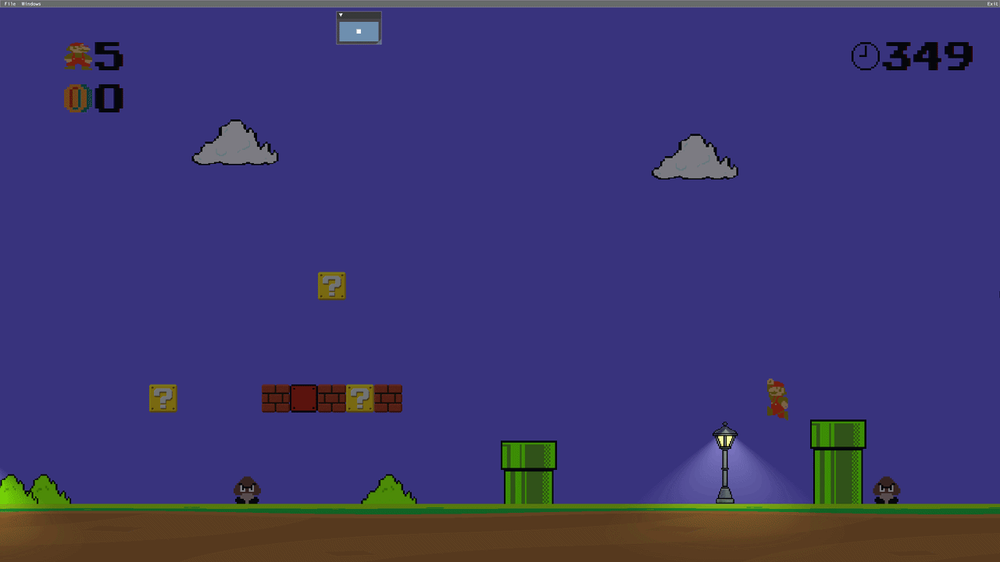
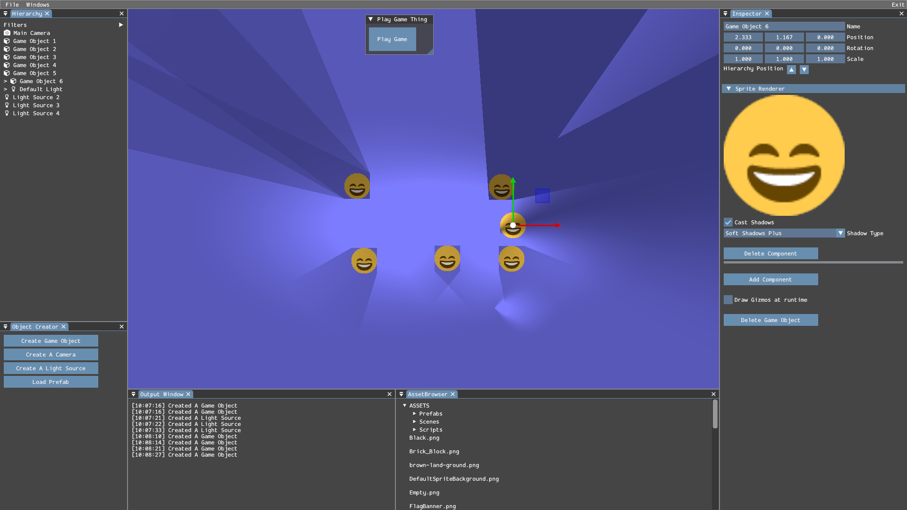
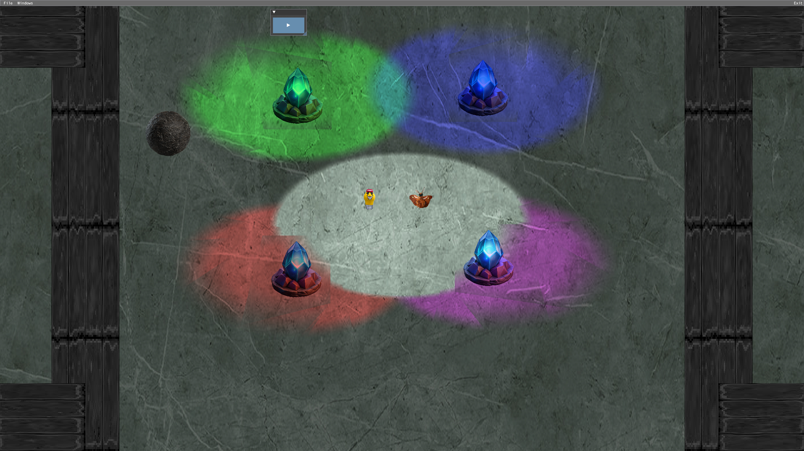
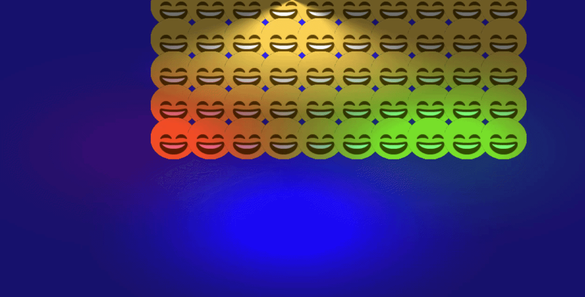
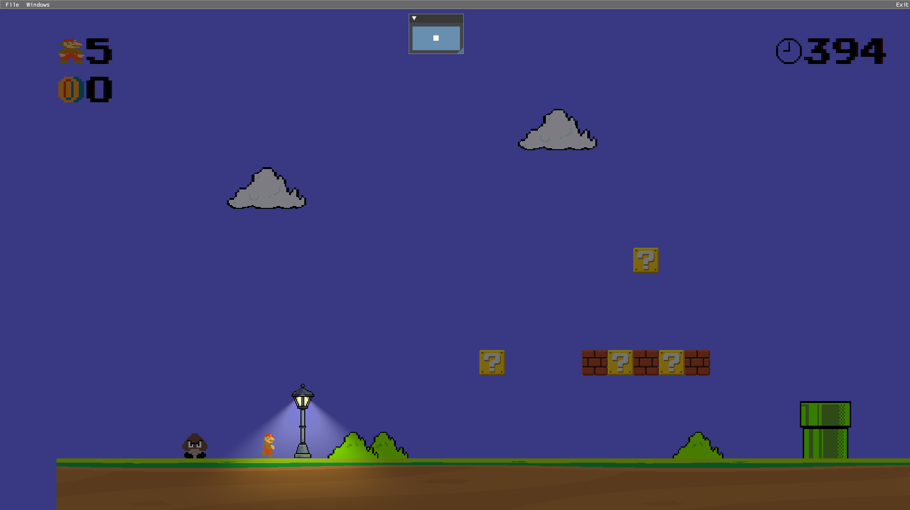
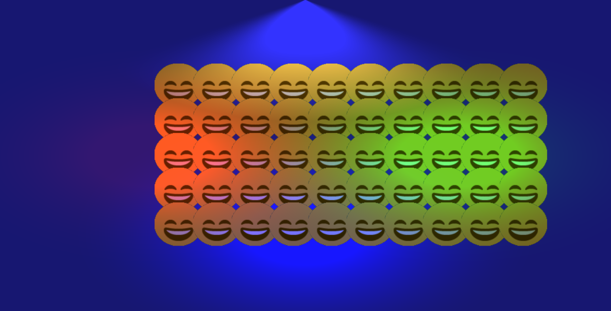

<!-- Gallery Section -->
<section class="project-gallery">

  <!-- Slide 1 -->
  

    
  

  <!-- Slide 2 -->
  

    
  

  <!-- Slide 3 -->
  

    
  

  <!-- Slide 4 -->
  

    
  

<!-- Navigation -->
<button class="prev" onclick="plusSlides(-1)" aria-label="Previous slide">❮</button>
<button class="next" onclick="plusSlides(1)" aria-label="Next slide">❯</button>

<!-- Caption -->

 

 

  <!-- Thumbnails -->
  

    

      
    

    

      
    

    

      
    

    

      
    

  

</section>

<!-- Overview -->
<section class="project-content">
  
// OVERVIEW

  
 This documentation goes over the overview of the architecture, rendering systems, and platform-specific implementation developed for the engine. The documents are separated into their areas to better explain their reasoning, implementation details and technical limitations of each system.

  <a href="GraphicsOverview.html" class="project-button"> DOCUMENTATION → </a>
</section>

<!-- Key Features -->
<section class="project-content">
  
// KEY FEATURES

  

    

      <h3>GRAPHICS BACKENDS</h3>
      
The main graphic backend for this project was DirectX 11, with a full port to PS5 and partial port to the web. 2 members of the team were in charge of this including me.

    

    

      <h3>LIGHTING AND SHADOWS</h3>
      
Can have up to 16 lights while maintaining 60+ fps. With three light types: point, spot and direction. And four shadow types: hard shadows, hard shadows+, soft shadows and soft shadows+.

    

    

      <h3>SCOPE AND TEAM PROJECT</h3>
      
This engine was developed within three months with 7 members in the team in charage of their own systems, so it was important to have consistent communication.

    

    

      <h3>CUSTOM ENGINE ARCHITECTURE</h3>
      
Focused on being cross platform and separating the differances between engine and game(s).

    

  

</section>

<!-- Web Port -->
<section class="project-content">
  
// WEB PORT VERSION

  
Note: This doesn't represent the newest state of the engine or what capabilities it has. This was my attempt at porting it over for the web within three days.

  <a href="{{ '/GelosEngine/index.html' | relative_url }}" target="_blank" rel="noopener noreferrer" class="project-button"> LAUNCH WEB PORT →</a>
</section>

<!-- Back -->
<section class="project-content">
  <a href="{{ '/' | relative_url }}" class="project-button"> ← BACK TO HOME </a>
  <a href="{{ '/pages/projects.html' | relative_url }}" class="project-button"> ← BACK TO PROJECTS </a>
</section>