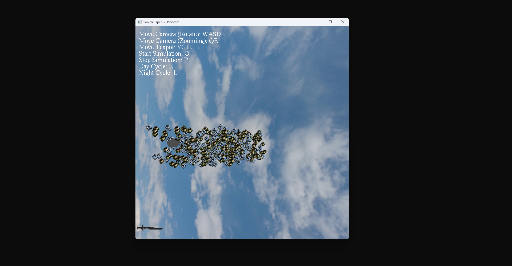
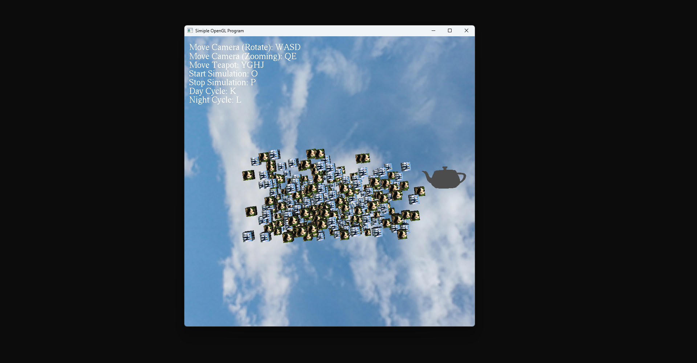
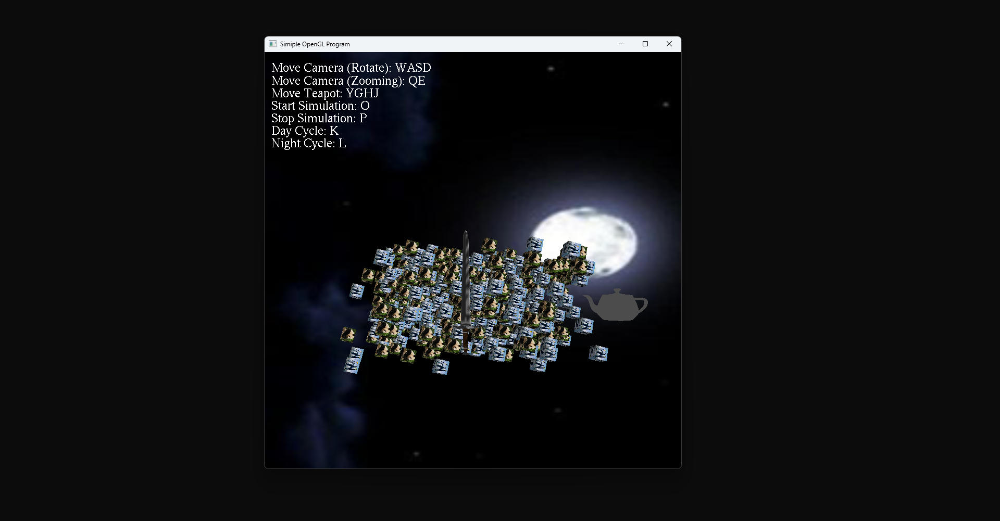
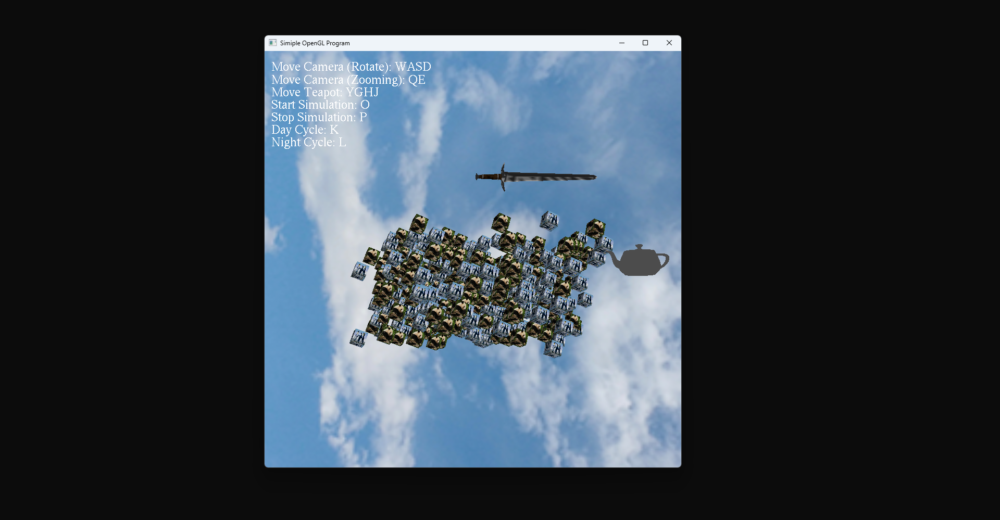

<!-- Gallery Section -->
<section class="project-gallery">

  <!-- Slide 1 -->
  

    <iframe src="https://www.youtube.com/embed/Kt8N6w_XSY0" title="GLUT Demo Trailer"
      frameborder="0" allowfullscreen> </iframe>
  

  <!-- Slide 2 -->
  

    
  

  <!-- Slide 3 -->
  

    
  

  <!-- Slide 4 -->
  

    
  

<!-- Navigation -->
<button class="prev" onclick="plusSlides(-1)" aria-label="Previous slide">❮</button>
<button class="next" onclick="plusSlides(1)" aria-label="Next slide">❯</button>

<!-- Caption -->

 

 

  <!-- Thumbnails -->
  

    

      
    

    

      
    

    

      
    

    

      
    

  

</section>

<!-- Overview -->
<section class="project-content">
  
// OVERVIEW

  
During this project I got introduced to graphics programming through OpenGL and didn’t really speak to me due to struggles with rendering from file. While it was working for the most part there was parts that were missing when rendering to screen. Other than that, though this project at a very basic level showed how to work with OpenGL and I created movement, camera system, and more inner workings.

</section>

<!-- Key Features -->
<section class="project-content">
  
// KEY FEATURES

  

    

      <h3>GLUT Pipeline</h3>
      
Loading and rendering multiple objects through the GLUT pipeline.

    

    

      <h3>Texturing</h3>
      
Applying different formats of texturing like .raw and .tga.

    

    

      <h3>Parsing OBJs</h3>
      
Parsing .obj format files to load objects like the teapot and sword.

    

  

</section>

<!-- Technical Breakdown -->
<section class="project-content" id="tilebasedmovement">
  
// TECHNICAL BREAKDOWN

  <h3>Object Loader</h3>
  
This project started with a mesh loader that worked by parsing through text files, but for more complex objects like the sword and teapot I needed to create an object loader.

  

    
     
      <em>This shows the sword OBJ in the GLUT applicatin. (Figure is clickable).</em>
  

  

    <pre><code>
// First snippet
void LoadVertices(ifstream& inFile, Mesh& mesh)
{
  inFile >> mesh.VertexCount;
  if (mesh.VertexCount > 0)
  {
    mesh.Vertices = new Vertex[mesh.VertexCount];
    for (int i = 0; i < mesh.VertexCount; i++)
    {
      inFile >> mesh.Vertices[i].x;
      inFile >> mesh.Vertices[i].y;
      inFile >> mesh.Vertices[i].z;
    }
  }
}
// Second snippet
// Vertices
vertices = new Vertex[numVertices];
// Skips random text
while (tempValue != "v")
{
  // Skips over the 'v' characters
  inFile >> tempValue;
}
// Assigns to vertices from file and goes till the num of vertices doesn't
for (int i = 0; i < numVertices; i++)
{
if (tempValue == "v")
{
  inFile >> vertices[i].x;
  inFile >> vertices[i].y;
  inFile >> vertices[i].z;
}
inFile >> tempValue;
}
    </code></pre>
  
  
  
The first snippet of code above was used for loading basic shapes like the cubes, but this wouldn't work for more complex objects like the sword and teapot. While the second snippet code shows the more complex version for the .obj with it going over each vertex and had checks for skipping random text due to not every .obj file being the same. With this it would load models nicely, but it had problems with textures. This is most likely since it doesn't have enough checks for all types of .obj internal structure. Typically OBJ loaders are big due to needing to account for all of the problems that come with people exporting their projects differently, and different software also needs to be accounted for.
   

  <h3>Scene Manipulation</h3>
  
An object of this project was to have scene manipulation. Through keybinds I am able to implement some varying logic to change what happens in the scene. Anywhere from controlling the camera with a keyboard and mouse to starting a "simulation", which would follow the sword. Below is an example of what is possible in the scene and also a code snippet.

  <ul>
    <li>Move Camera (Rotate): WASD</li>
    <li>Move Camera (Zoom): QE</li>
    <li>Move Teapot: YGHJ</li>
    <li>Start Simulation: O</li>
    <li>Stop Simulation: P</li>
    <li>Day Cycle: K</li>
    <li>Night Cycle: L</li>
    <li>Move Camera (Look): Mouse</li>
  </ul>
  

    <pre><code>
switch (key)
{
  // Inputs for camera
  case 'w':
  camera->eye.y += 1.00f;
    break;
  case 'a':
  camera->eye.x += 1.00f;
    break;
}
    </code></pre>
  
 
  
The code above is an example of key switching for a keyboard and what it sets.

  <h3>Texturing and Lighting</h3>
  
During this project I had to load in multiple formats of textures and set up lighting with material. For texturing I was able to load in .raw and .tga formatted texture files and then apply them to various objects in the scene. As an example, the cubes had penguins and pandas, while the sword had a specific sword texture. Then for the scene, I set up a light with ambience, diffusion, specular and position. Similarly to material for the cubes, where I put ambience, diffusion, specularity, and position.

  

    <pre><code>
// Cube textures (using both a raw and tga formats)
Texture2D* cubeTextureRAW = new Texture2D();
Texture2D* cubeTextureTGA = new Texture2D();
cubeTextureRAW->LoadTextureRAW((char*)"penguins.raw", 512, 512);
cubeTextureTGA->LoadTextureTGA("Panda.tga");
// Sword texture
Texture2D* longSword = new Texture2D();
longSword->LoadTextureTGA("LongSword.tga");
// Load in sword obj and then assign the texture for it
Sword::Load((char*)"LongSword.obj");
sword = new Sword(longSword);
    </code></pre>
  

  
The code above shows the different textures, loading them in and applying them.

  

    <pre><code>
glLightfv(GL_LIGHT0, GL_AMBIENT, &(_lightData->Ambient.x));
glLightfv(GL_LIGHT0, GL_DIFFUSE, &(_lightData->Diffuse.x));
glLightfv(GL_LIGHT0, GL_SPECULAR, &(_lightData->Specular.x));
glLightfv(GL_LIGHT0, GL_POSITION, &(_lightPosition->x));
    </code></pre>
  

  
The code above shows the light data of ambient, diffuse, specular and position getting applied.

  

    <pre><code>
MaterialCube();
glMaterialfv(GL_FRONT, GL_AMBIENT, &(_material->Ambient.x));
glMaterialfv(GL_FRONT, GL_DIFFUSE, &(_material->Diffuse).x);
glMaterialfv(GL_FRONT, GL_SPECULAR, &(_material->Specular).x);
glMaterialf(GL_FRONT, GL_SHININESS, _material->Shininess);
    </code></pre>
   

   
The code above shows the material data of ambient, diffuse, specular and shininess getting applied.

</section>

<!-- Back -->
<section class="project-content">
  <a href="{{ '/' | relative_url }}" class="project-button"> ← BACK TO HOME </a>
  <a href="{{ '/pages/projects.html' | relative_url }}" class="project-button"> ← BACK TO PROJECTS </a>
</section>