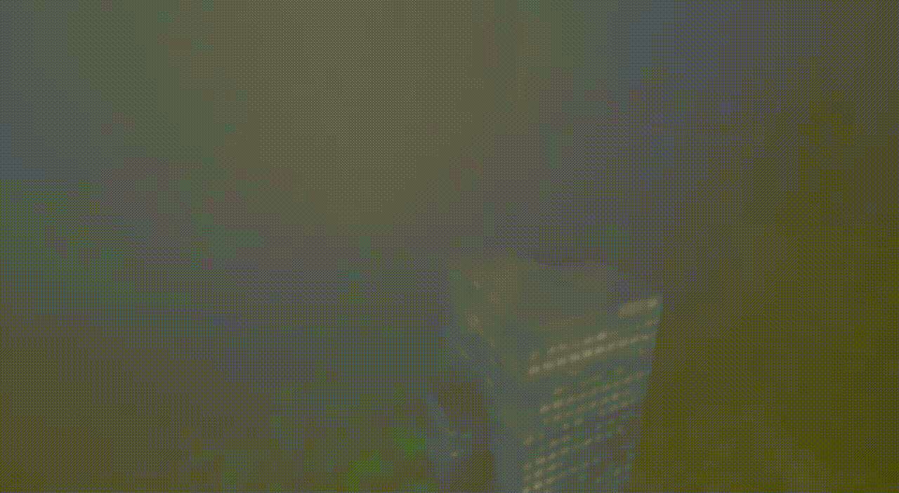
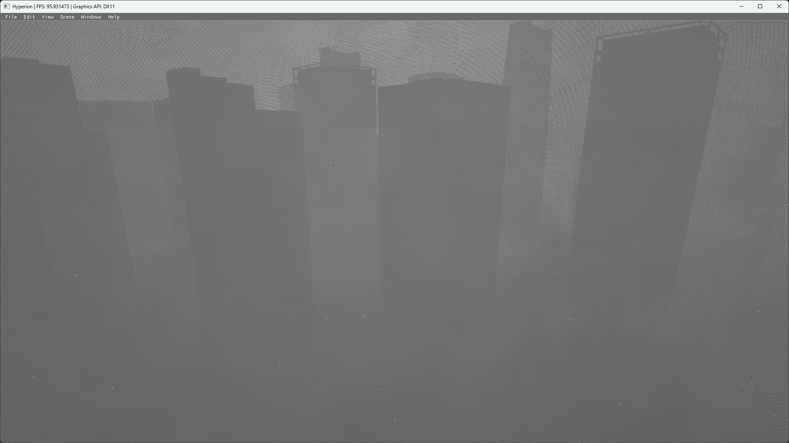
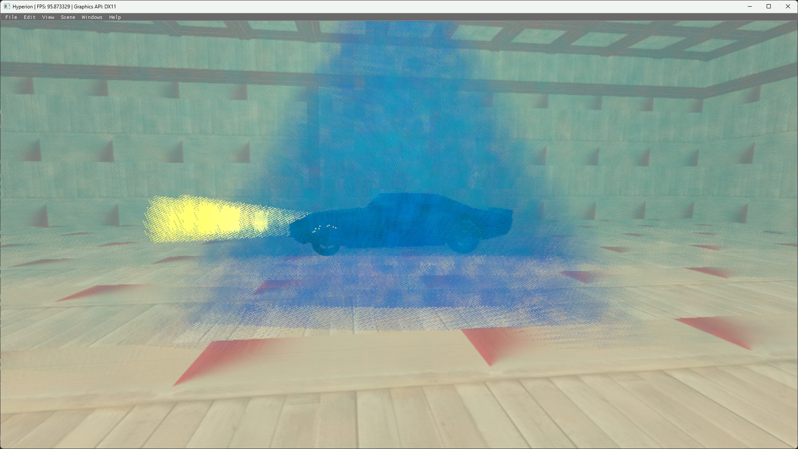
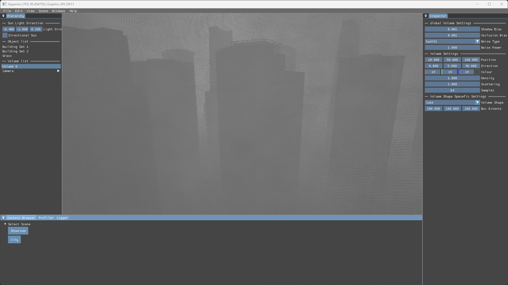

<!-- Gallery Section -->
<section class="project-gallery">

  <!-- Slide 1 -->
  

    
  

  <!-- Slide 2 -->
  

    
  

  <!-- Slide 3 -->
  

    
  

  <!-- Slide 4 -->
  

    
  

<!-- Navigation -->
<button class="prev" onclick="plusSlides(-1)" aria-label="Previous slide">❮</button>
<button class="next" onclick="plusSlides(1)" aria-label="Next slide">❯</button>

<!-- Caption -->

 

 

  <!-- Thumbnails -->
  

    

      
    

    

      
    

    

      
    

    

      
    

  

</section>

<!-- Overview -->
<section class="project-content">
  
// OVERVIEW

  
 This project looks at creating realistic and optimised volumetric lighting/fog. Fully built up from the ground up from the architecture of the framework, object loader, texture manager and much more.  Works best with volume-bound volumetric lighting, which allows cities to be encased in volumetric fog and particle lights in a showroom. Currently looking into DirectX 12.

</section>

<!-- Key Features -->
<section class="project-content">
  
// KEY FEATURES

  

    

      <h3>VOLUMETRIC LIGHTING</h3>
      
Real-time volumetric lighting and fog using volume-bound lighting calculations.

    

    

      <h3>DIRECTX 11 / 12</h3>
      
Rendering architecture developed around DirectX 11 and DirectX 12.
      

    

    

      <h3>REAL-TIME FOG</h3>
      
Real-time volumetric fog with configurable density, decay, exposure, colour and sample settings.

    

    

      <h3>PERFORMANCE</h3>
      
The renderer includes GPU-focused techniques and configurable rendering settings for investigating performance.

    

  

</section>

<!-- Documentation -->
<section class="project-content">
  
// DOCUMENTATION

  
Technical documentation covering the project and its implementation.

  <a href="Documentation\Overview.html" class="project-button"> VIEW DOCUMENTATION → </a>
</section>

<!-- Back -->
<section class="project-content">
  <a href="{{ '/' | relative_url }}" class="project-button"> ← BACK TO HOME </a>
  <a href="{{ '/pages/projects.html' | relative_url }}" class="project-button"> ← BACK TO PROJECTS </a>
</section>