<!-- Gallery Section -->
<section class="project-gallery">

  <!-- Slide 1 -->
  

    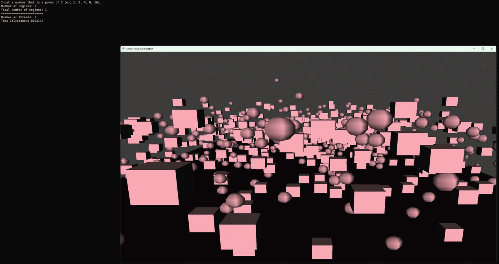
  

  <!-- Slide 2 -->
  

    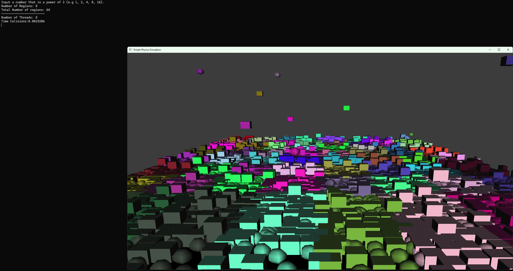
  

  <!-- Slide 3 -->
  

    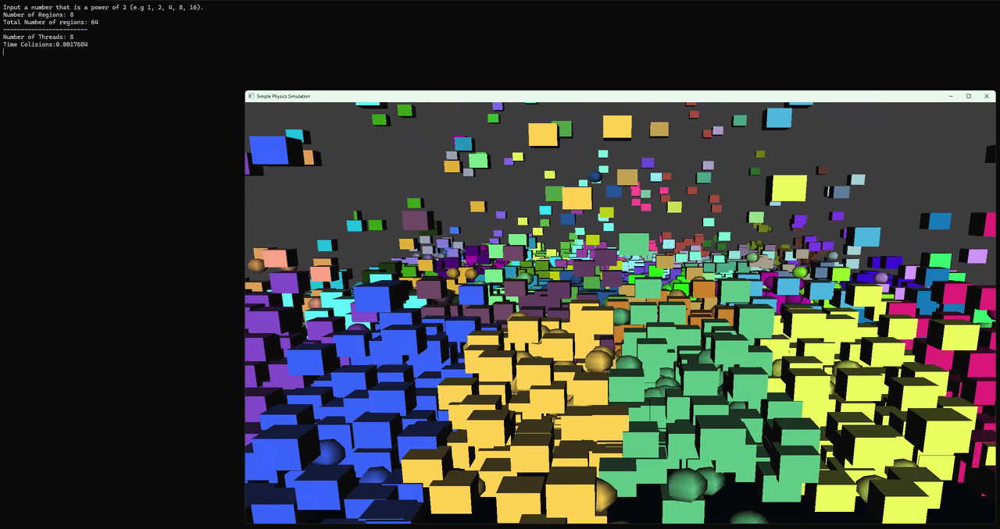
  

  <!-- Slide 4 -->
  

    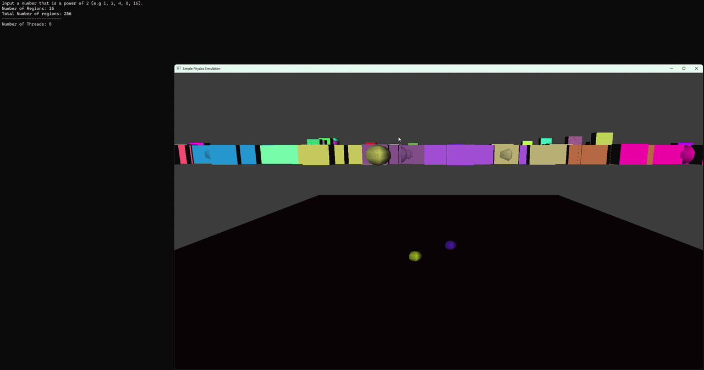
  

<!-- Navigation -->
<button class="prev" onclick="plusSlides(-1)" aria-label="Previous slide">❮</button>
<button class="next" onclick="plusSlides(1)" aria-label="Next slide">❯</button>

<!-- Caption -->

 

 

  <!-- Thumbnails -->
  

    

      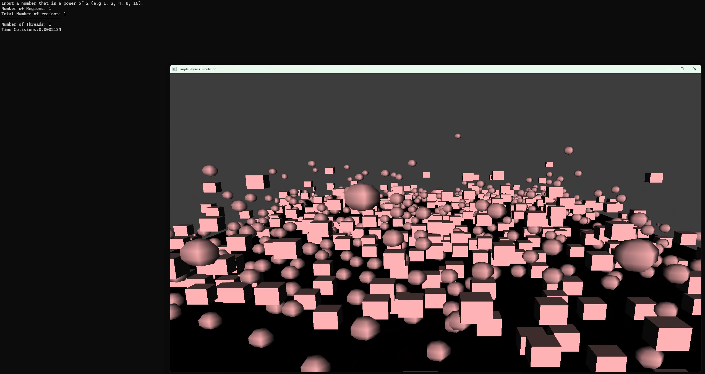
    

    

      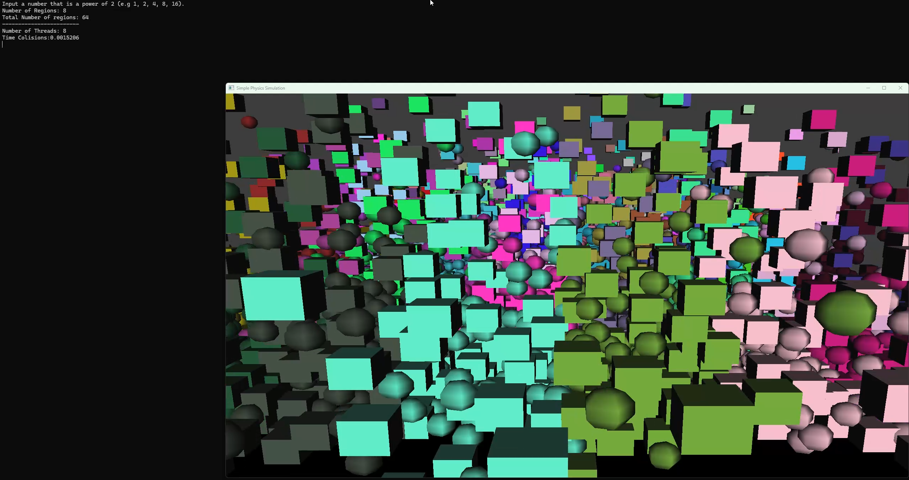
    

    

      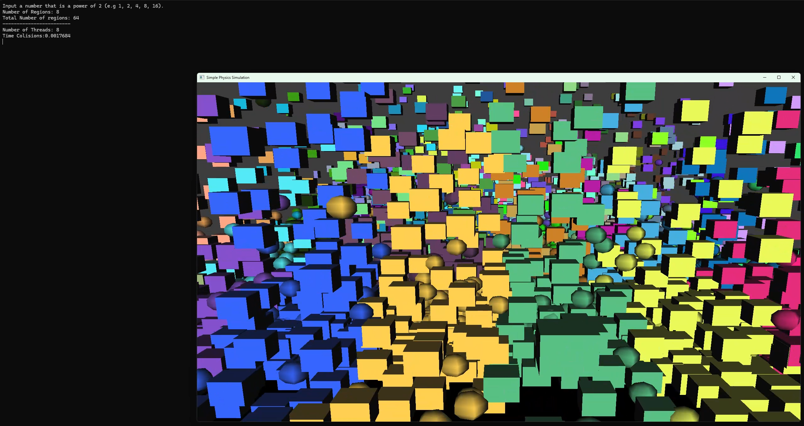
    

    

      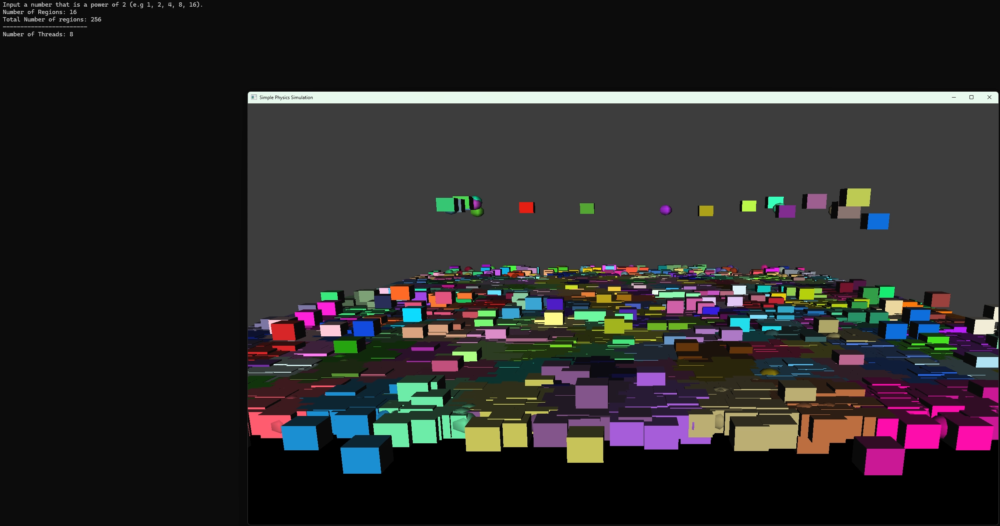
    

  

</section>

<!-- Overview -->
<section class="project-content">
  
// OVERVIEW

  
This project looked at low-level optimisation techniques such as memory management, timing optimisations and porting over to PS5. A custom memory manager system was implemented to track memory allocations, this included an allocation tracker, object creation and destruction, and a memory pool to reduce allocation overhead by reusing pre-allocated memory. Performance improvements were achieved through spatial partitioning, which split the scene and reduced collision checks. Finally, a multithreaded system was applied to this that allowed the regions of the scene to be checked at the same time.

</section>

<!-- Key Features -->
<section class="project-content">
  
// KEY FEATURES

  

    

      <h3>Memory Management</h3>
      
Custom memory allocation tracking, object lifecycle control, and memory pooling to reduce allocation overhead.

    

    

      <h3>Spatial Partitioning</h3>
      
Reduced collision checks by dividing the scene into regions.

    

    

      <h3>Multithreading</h3>
      
Processed spatial regions in parallel to improve performance.

    

    

      <h3>PlayStation 5 Optimisation</h3>
      
Explored low-level optimisation techniques for PS5.

    

  

</section>

<!-- Technical Breakdown -->
<section class="project-content" id="memorytracker">
  
// TECHNICAL BREAKDOWN

  <h2>Memory Management</h2>
  <h3>Memory Allocation Tracker</h3>
  
A custom memory tracking system was implemented to monitor object allocations at runtime. This was done through multiple tracker instances like box, sphere, and global (all objects), where each tracked their respective object type. The trackers managed their total allocation and deallocations of which objects were still using memory at runtime.

  <table align="center">
    <tr>
      <td align="center" valign="middle" style="width: 50%;">
        <a href="MemoryTracker.png"> 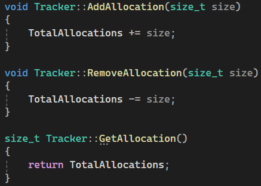 </a>
      </td>
      <td align="center" valign="middle" style="width: 50%;">
        <a href="MemoryTrackerAllocation.png"> 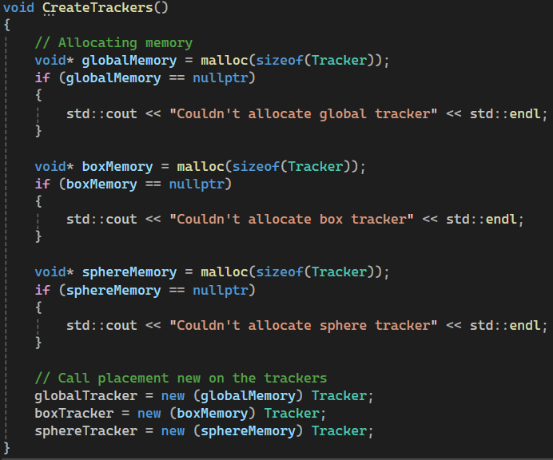 </a>
      </td>
    </tr>
    <tr>
      <td colspan="2" align="center">
         
        <em>The first code shows what is inside the tracker class and some functions of it. While the second piece shows the trackers getting   their own allocation of memory through malloc. (Figures are clickable)</em>
      </td>
    </tr>
  </table>

  <h3>Object Removal</h3>
  
Objects were removed through the object's collider that was closest to the screen cursor upon getting clicked and removed from the all object vector. Initially there were threading issues when using "std::vector::erase"; however, by adding synchronisation to ensure all threads complete their tasks before deleting an object, this prevents race conditions from happening and any dangling pointers that would come.

  

    <a href="EraseObjects.png"> 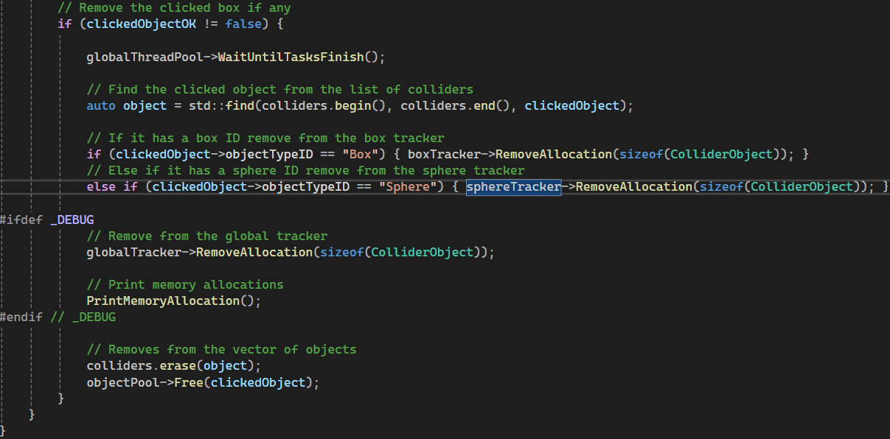 </a>
     
    <em>This shows of the code that I talking about from above. (Figure is clickable).</em>
  

  <h3>Performance Timer</h3>
  
A simple timing profiler was added through "std::chrono" to measure the execution time of physics and the multithreaded systems. Data was accumulated over 60 frames to provide a more stable performance comparison between tests.

  <table align="center">
    <tr>
      <td align="center" valign="middle" style="width: 50%;">
        <a href="TimerUse.png"> 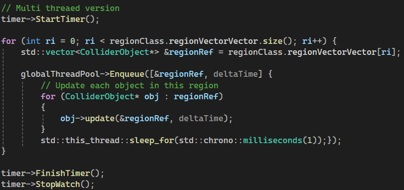 </a>
      </td>
      <td align="center" valign="middle" style="width: 50%;">
        
      </td>
    </tr>
    <tr>
      <td colspan="2" align="center">
         
        <em></em>
      </td>
    </tr>
  </table>

  <h3>Memory Pool</h3>
  
To reduce runtime allocation overhead and avoid heap fragmentation, a memory pool was implemented to preallocate memory for game objects at runtime. Instead of allocating memory dynamically per object, objects are instead constructed using placement new from preloaded memory blocks within the memory pool. This system allowed memory to be reused from the pool and destroyed objects, enabling new objects to be created without repeated heap allocations.

</section>

<!-- Back -->
<section class="project-content">
  <a href="{{ '/' | relative_url }}" class="project-button"> ← BACK TO HOME </a>
  <a href="{{ '/pages/projects.html' | relative_url }}" class="project-button"> ← BACK TO PROJECTS </a>
</section>