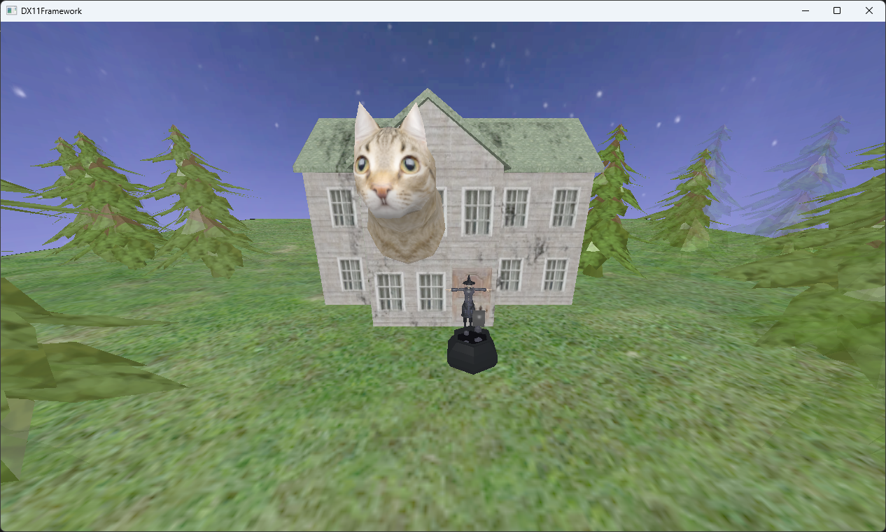
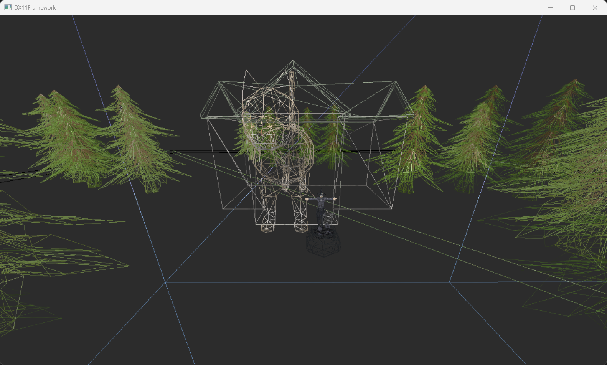
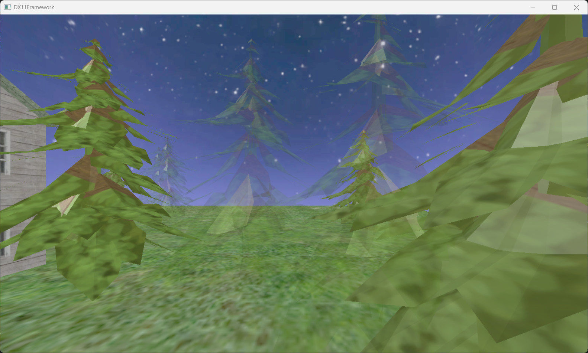
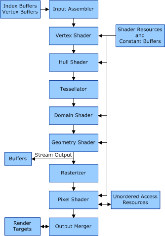
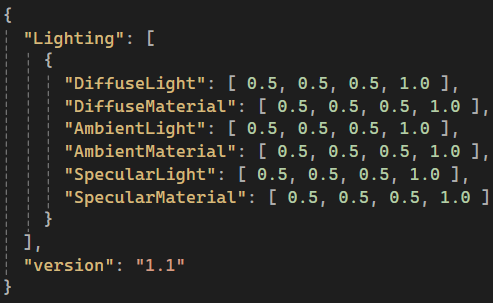

<!-- Gallery Section -->
<section class="project-gallery">

<!-- Slide 1 -->

  <iframe 
    src="https://www.youtube.com/embed/hXlKtwVcpxY" title="Witch Forest Trailer"
    frameborder="0" allowfullscreen>
  </iframe>

<!-- Slide 2 -->

  

<!-- Slide 3 -->

  

<!-- Slide 4 -->

  

<!-- Navigation -->
<button class="prev" onclick="plusSlides(-1)" aria-label="Previous slide">❮</button>
<button class="next" onclick="plusSlides(1)" aria-label="Next slide">❯</button>

<!-- Caption -->

  

<!-- Thumbnails -->

  

    
  

  

    
  

  

    
  

  

    
  

</section>

<!-- Overview -->
<section class="project-content">
  <h3>Overview</h3>
  
The project aimed at creating a real-time 3D environment using DirectX 11, implementing custom vertex and pixel shaders for the rendering pipeline to manage object transformations, lighting models and shading. Drawing inspiration from my heritage, I created the <strong>Witch Forest</strong> to demonstrate technical graphic skills.

  
A key challenge was designing a hierarchical scene graph to manage an object's transformation and relationship to other objects. While the system was successful in doing both to an extent and highlighted initial design flaws from the beginning. This ultimately still had problems with struggling to maintain child-parent relationships with more than 1 parent. Even with that, this remains to still be one of my favourite projects since it showed me what graphic programming is capable of.

</section>

<!-- Key project features -->
<h3>Key Features</h3>
<section class="features">
  

    <h3>DirectX 11 Pipeline</h3>
    
Learning about custom rendering pipelines, buffers and shaders.

  

  

    <h3>Scene Hierarchy</h3>
    
Recursive parent-child transformations.

  

  

    <h3>JSON Breakdown</h3>
    
JSON system for runtime lighting parameters.

  

</section>

<!-- Technical Breakdown -->
<section class="project-content">
  <h2 class="tech-title">Technical Breakdown</h2>

<!-- Card 1 -->

  

    <h3>DirectX 11</h3>
    <h4>Graphics Pipeline</h4>
    
While not a feature/system of the artefact, this project is where I learnt a lot of fundamental knowledge for DirectX 11. Started with learning the theoretical knowledge of the graphics pipeline and worked with the input assembler to feed data through. Vertex shader for transforming the geometry and the pixel shader for texturing and colouring.

    <h4>Buffers and Resources</h4>
    
Used vertex buffers to store the positions, normals, and texture coordinates of the object. While an index buffer was used to define how the triangle would use the same vertices for efficiency. Lastly, a constant buffer for storing the transform matrices, the lighting data, and camera properties.

  

  
 
    
  

<!-- Card 2 -->

  

    <h3>Scene Hierarchy</h3>
    
This system was built for rendering game objects, applying their textures, applying their transforms and drawing meshes recursively through a hierarchical scene graph structure.

  

<pre><code>
XMMATRIX newChild = _GameObjects[i]->_transform * base;
_GameObjects[i]->DrawGameObjects(_immediateContext, newChild, cbdata, constantbuffer, mappedSubresource);
</code></pre>
  

  
The code above shows the example of the recursive nature where it would multiply the parent's transform (base) with the current child's transform (game objects).

  

<pre><code>
_immediateContext->IASetVertexBuffers(0, 1, &GetMeshData()->VertexBuffer, &GetMeshData()->VBStride, &GetMeshData()->VBOffset);
_immediateContext->IASetIndexBuffer(GetMeshData()->IndexBuffer, DXGI_FORMAT_R16_UINT, 0);
_immediateContext->DrawIndexed(GetMeshData()->IndexCount, 0, 0);
</code></pre>
  

  
The code above shows how the vertex and index buffers are set, with this being crucial when it comes to drawing the object.

  
Lastly, to improve the system, instead of sending data to the constant buffer for each object, it would be better to send it all at once. Then there are specific hard-coded conditions like checking the object index, which could be removed and added as a check. The last concern is the fact the hierarchy only cares about the parent object, which is blank and nothing else due to its nature. This could be improved to add children objects and add the associated logic with that.

  

  

    
  

<!-- Card 3 -->

  

  <h3>JSON Breakdown</h3>
  
The image shows an example of JSON data that will be parsed at runtime. This specific file houses lighting parameters, which are used for the lighting in the artefact.
 
  

<pre><code>
json jFile;
std::ifstream fileOpen("JSON/LightingFormat.json");
jFile = json::parse(fileOpen);
json& objects = jFile["Lighting"]; //Gets an array
int size = objects.size(); //Size of array
for (unsigned int i = 0; i < size; i++)
{
  LightingStruct g;
  json& objectDesc = objects.at(i);
  g.DiffuseLight.x = objectDesc["DiffuseLight"][0];
  g.DiffuseLight.y = objectDesc["DiffuseLight"][1];
  g.DiffuseLight.z = objectDesc["DiffuseLight"][2];
  g.DiffuseLight.w = objectDesc["DiffuseLight"][3];
}
</code></pre>
  

  
Doing parsing from the code sample above into a lighting struct that matches the structure of JSON keys. This is then sent to the GPU via a constant buffer using similar logic without the need to parse, of course. When the constant buffer is set, the shader can use the data from the lighting parameters during rendering. Using JSON files is a good way to manage lighting parameters that can be modified quickly.

  
To accomplish the task, it used the nlohmann version of JSON, and while there were other options like YAML, I felt at the time JSON was the easiest to implement. Lastly, ways to improve this would be moving the logic out of the game object class and having a separate class manage data like this. As a safety measure, adding error handling, e.g., file existing, fallbacks, etc., would help catch anything wrong without picking apart the code for hours.

  

  

    
  

</section>